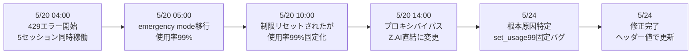

## はじめに

2026年5月20日、私の開発環境が**429エラーの嵐**に見舞われました。

GLM APIのレート制限に到達 → レートプロキシのバグ → 不要なフォールバック永続化 → 開発完全停止。

この3日間のインシデントの**原因・対応・教訓**を記録します。

## インシデント概要

| 日付 | 出来事 |
|------|--------|
| 5/20 | Z.AI API 5時間制限到達 → 429連発 → MiniMaxフォールバック |
| 5/20 | プロキシ使用率99%固定化 → 制限リセット後もMiniMax継続 |
| 5/20 | ユーザーがプロキシをバイパス（GLM直結に変更） |
| 5/24 | バグの根本原因特定・修正 |

## タイムライン



### Day 1: 5月20日 04:00 — 429エラー開始

```
510リクエスト中:
  正常レスポンス: 342件（67%）
  429エラー: 108件（21%）
  MiniMaxフォールバック: 60件（12%）
```

原因: 5つのClaude Codeセッションを同時稼働 → Z.AI APIの5時間ウィンドウ制限に到達。

### Day 1: 05:00 — プロキシがemergency modeに移行

```
使用率: 95% → 99%
プロキシ動作: GLM-5.1 → GLM-4.7-Flash → MiniMax
```

ここまでは**正常な動作**。問題は次。

### Day 1: 10:00 — 制限リセットされたのに99%のまま

Z.AI APIの5時間ウィンドウがリセット → 実際の使用率は0%に戻った。しかしプロキシ内の使用率は**99%のまま固定**。

```
Z.AI Dashboard: 使用率 2%（正常）
プロキシ内部: 使用率 99%（異常）
```

結果: プロキシはずっとMiniMaxを使い続ける。

### Day 1: 14:00 — プロキシをバイパス

```bash
# ~/.secrets.env
ANTHROPIC_BASE_URL=https://api.z.ai/api/anthropic  # 直結
```

プロキシ経由をやめてZ.AI直結に変更。これでGLM-5.1に復帰。

しかし、**根本原因は解決していません**。

## Day 4: 根本原因の特定（5月24日）

### バグ1: 使用率の99%固定化

```python
# proxy.py L93 — バグのコード

# GLM-4.7-Flash成功時の処理
resp = await self._upstream.request_glm_flash(...)
self._tracker.set_usage(99.0)  # ← 常に99%を設定
```

**問題**: `set_usage(99.0)` は固定値。レスポンスヘッダーの実際の使用率を無視している。

```python
# 修正後
resp = await self._upstream.request_glm_flash(...)
self._tracker.update_from_headers(resp["headers"])  # ← 実際の使用率で更新
```

### バグ2: MiniMax成功時のトラッカー未更新

```python
# proxy.py L108-114 — バグのコード

resp = await self._upstream.request_minimax(...)
logger.info(f"MiniMax fallback succeeded")
# tracker更新なし → 使用率が変わらない
```

MiniMaxフォールバックが成功しても、トラッカーが更新されない。結果として**使用率が永久に下がらない**。

```python
# 修正後
resp = await self._upstream.request_minimax(...)
logger.info(f"MiniMax fallback succeeded")
self._tracker.update_from_headers(resp["headers"])  # ← 追加
```

## 修正後の動作

```
1. GLM 429 → emergency mode → MiniMaxに切替 ✅
2. 5時間制限リセット後、次のGLM成功レスポンスで使用率が更新 ✅
3. 使用率が80%を下回ったら自動でnormal modeに復帰 ✅
```

## 教訓

### 1. レート制限の復旧判定は「時間経過」ではなく「実際の値」で

```python
# ❌ 時間経過で復旧を仮定
if time.time() - last_429 > 5 * 3600:
    reset_usage()  # 実際の使用率を確認していない

# ✅ 実際の値で復旧を確認
usage = get_usage_from_headers(response)
if usage < 80:
    switch_to_normal_mode()
```

### 2. フォールバック先の成功も監視する

フォールバック先（MiniMax）が成功しても、**メインの状態（使用率）は更新されない**ことを意識する。

### 3. プロキシのバイパス手段を用意する

```bash
# 緊急時の1コマンド復旧
pkill -f glm_rate_proxy  # プロキシを止めるだけ
# 次回起動時に自動でZ.AI直結になる
```

### 4. ログに使用率を記録する

```
2026-05-20 04:00 usage=85% mode=economy
2026-05-20 05:00 usage=99% mode=emergency  ← ここからおかしい
2026-05-20 10:00 usage=99% mode=emergency  ← リセットされたはずが99%
```

ログを見れば**いつから異常か**一目了然。

## 再発防止

- [x] 使用率をヘッダーから取得（ハードコード禁止）
- [x] MiniMax成功時のトラッカー更新
- [x] プロキシバイパス手段の文書化
- [x] インシデント記録のSSOT保存

---

*この記事はClaude Code（GLM-5.1）と一緒に書きました。*
