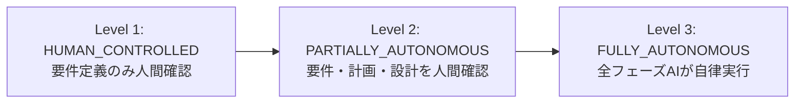

## はじめに

AIエージェントに開発を任せる場合、「どこまで自動で進めてよいか」は重要な設計判断です。要件定義だけ人間が確認したい場合もあれば、全自動で進めてほしい場合もあります。

本記事では、AIによる開発パイプラインの自律度を3段階で制御する権限設計（Authority Level）を紹介します。

## 3段階の権限レベル



### 各レベルで実行されるフェーズ

| フェーズ | Level 1 | Level 2 | Level 3 |
|---|---|---|---|
| REQUIREMENTS（要件定義） | 人間確認 | 人間確認 | 自動 |
| PLAN（計画） | 自動 | 人間確認 | 自動 |
| ARCHITECTURE（設計） | 自動 | 人間確認 | 自動 |
| IMPLEMENTATION（実装） | 自動 | 自動 | 自動 |
| TESTING（テスト） | 自動 | 自動 | 自動 |
| REVIEW（レビュー） | 自動 | 自動 | 自動 |

## Authority Runnerの実装

### フェーズ実行の制御

各権限レベルに応じて、どのフェーズの前に人間の承認が必要かを制御します。

```python
class AuthorityLevel:
    HUMAN_CONTROLLED = 1
    PARTIALLY_AUTONOMOUS = 2
    FULLY_AUTONOMOUS = 3
```

```python
PHASE_STOPS = {
    AuthorityLevel.HUMAN_CONTROLLED: ["plan"],
    AuthorityLevel.PARTIALLY_AUTONOMOUS: ["implementation"],
    AuthorityLevel.FULLY_AUTONOMOUS: [],
}
```

- **Level 1**: PLANフェーズの前で停止（要件定義の結果を人間が確認）
- **Level 2**: IMPLEMENTATIONフェーズの前で停止（設計まで人間が確認）
- **Level 3**: 停止なし（全自動）

### セッション管理

人間の確認待ちになった場合、セッションを一時保存し、再開時に続きから実行できる仕組みです。

```python
class AuthorityRunner:
    def execute_phase(self, phase, context):
        if phase.name in self.stop_before_phases:
            # セッション状態を保存
            self.save_session(context)
            # 人間に確認を要求
            return self.request_human_approval(phase, context)

        # フェーズを実行
        result = phase.run(context)
        return result

    def resume_session(self, session_id):
        # 保存されたセッションを読み込み、次フェーズから再開
        context = self.load_session(session_id)
        return self.continue_from(context.current_phase + 1, context)
```

## 各レベルの使いどころ

### Level 1: HUMAN_CONTROLLED

**用途**: 新規プロジェクトの初期フェーズ、要件が不明確な場合

**メリット**:
- 要件の食い違いを早期に発見できる
- 方向性が固まる前にコストをかけない

**デメリット**:
- 人間の介入が必要なため、連続稼働できない

### Level 2: PARTIALLY_AUTONOMOUS

**用途**: 要件は明確だが、アーキテクチャの選択肢を人間が判断したい場合

**メリット**:
- 技術的な意思決定（ライブラリ選定、DB選択等）を人間が制御
- 実装以降は高速に自動進行

**デメリット**:
- 設計レビューのタイミングで待ちが発生

### Level 3: FULLY_AUTONOMOUS

**用途**: 小規模な機能追加、バグ修正、テスト拡充等の定型作業

**メリット**:
- 人間の介入なしで完了するため、夜間や長時間の自律稼働が可能
- 高速な反復サイクル

**デメリット**:
- 方向性の誤りに気づくのが遅れるリスク

## セキュリティと安全装置

### 強制停止ポイント

権限レベルに関わらず、以下のケースでは必ず人間の承認が必要です。

- 本番環境へのデプロイ
- データベーススキーマの変更
- セキュリティ関連のコード変更（認証・認可等）
- 依存関係の追加・更新

### セッションの状態永続化

一時停止したセッションは、ファイルに保存されます。

```
sessions/
├ session_20260521_001.json
│   ├── authority_level: 2
│   ├── current_phase: "architecture"
│   ├── stop_before: "implementation"
│   ├── context: { ... }
│   └── created_at: "2026-05-21T10:00:00"
```

再開時は、保存されたコンテキストを読み込み、停止したフェーズの次から実行を再開します。

## 設計判断の背景

### なぜ3段階か

2段階（手動/全自動）では粒度が粗すぎ、4段階以上では管理が煩雑になります。3段階は以下の判断軸に対応しています:

- **要件の確定度**: 未確定 → Level 1、確定 → Level 2/3
- **技術的リスク**: 高い → Level 1/2、低い → Level 3
- **人間の稼働状況**: 常時監視可能 → Level 1/2、離席 → Level 3

### なぜフェーズ単位か

関数やファイル単位での権限制御も考えられますが、開発パイプラインはフェーズ単位で意味的な区切りがあるため、フェーズ単位の方が直感的に理解しやすく、運用もシンプルです。

## この設計の限界

- **フェーズ内の部分承認がない**: 「このファイルは自動でOK、このファイルは確認したい」という粒度の制御はない
- **権限変更の動的切り替え**: 実行中のレベル変更は、セッションの再作成が必要
- **人間承認のUX**: 現在はターミナルベースの確認のみ。Web UI等の改善余地あり

## おわりに

AIに開発を任せる際、「全てか無か」ではなく、段階的な権限設定を用意することが、実用性の鍵です。

Level 1で要件を確認し、問題なければLevel 2に引き上げ、信頼が積み上がったらLevel 3で全自動運用に移行する。この段階的な移行パターンが、安全かつ効率的な自律開発の実践方法です。

### 関連記事

- [14のAIエージェントを協調させるマルチエージェントアーキテクチャの設計](https://zenn.dev/fukukei23/articles/multi-agent-orchestration-design)
- [AIエージェントの自己修復ループ設計](https://zenn.dev/fukukei23/articles/ai-agent-self-healing-loop)
- [複数LLMプロバイダーのタスク自動振り分け設計](https://zenn.dev/fukukei23/articles/llm-task-routing-design)
