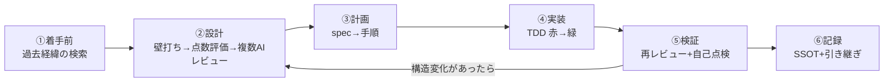

## はじめに

AIコーディングエージェントで開発をしていると、こんな感覚に陥ることがあります。

- 「何を頼むか」を毎回ゼロから考えている
- AIの提案が良さそうに見えるが、**根拠が自分でも分からないまま**進んでいる
- 実装は終わった気がするが、「本当に大丈夫か？」の確認が人間の気合い頼み

この記事では、これを解決するために組み立てた**「判断が収束する開発ループ」**を紹介します。核心はシンプルで、次の1文に尽きます。

> **AIの判断を「そのまま採用」せず、「複数AIに叩かせて、実測で裁定する」工程をループに組み込む**

## 全体フロー

「始めた後どう進むか」の6ステップです。「何を始めるか」はタスクの入口（自動化作成・新機能・是正・記事執筆・意思決定…）で切り、入口ごとに使うスキルの組み合わせを決めておくと、毎回の手順検討が不要になります。

## 6ステップの解説

### ① 着手前：過去経緯の検索を「必須」にする

新しい取り組みを始める前に、**過去に同じ課題を扱っていないかを必ず検索**します。特に重要なのが「**過去に否定された手法の再試行防止**」です。AIは記憶が無いため、数ヶ月前に却下されたアプローチを平気で再提案してきます。検索を怠ると、否定済みの道をまた歩きます。

### ② 設計：壁打ち→点数評価→複数AIレビュー（判断収束ループ）

ここが本記事の核心です。

1. **壁打ち（brainstorming）**で要件を言葉にする
2. 選択肢が出たら**点数評価（比較・淘汰）**で判断材料を数値化する
3. 改訂案ができたら**複数LLMに同一プロンプトで独立レビュー**させる（先入観のない並列指摘）

ポイントは「1つのAIに納得させない」こと。**モデルの多様性**を使い、各LLMが独立に発見する死角の非重複性をバッファにします。

### ③ 計画：spec→手順

設計が固まったら、手順書（plan）に落とします。ここでの要点は**着手条件・fail条件を書いておく**こと。「失敗と分かるのはどんな時か」を事前に定義しておくと、後段の検証が機械的になります。

### ④ 実装：TDD（赤→緑）

テストを先に書き、そのテストが通るように実装します。「テストを書いた後に実装」は、**自分（とAI）の楽な方向への近道を構造的に塞ぐ**効果があります。AIは楽な方向にサボる生き物なので、テストの存在が最後の防波堤になります。

### ⑤ 検証：再レビュー+自己点検

実装が終わったら**再度、複数LLMでレビュー**します。この時の重要ルールが **blind再レビュー** です。

- **修正履歴を渡さない**（現行コード+当初目的のみを見せる）
- 先入観で「修正済み領域の再検証」が抑制されるのを構造的に防ぐ

加えて**自己点検**（自らの実装の穴を黒箱列挙→機械検証）を行います。人間が「テストは十分？」と1問入れるだけで、複数AIの網羅盲点が露出することが実測されています。

### ⑥ 記録：SSOT+次セッションへの引き継ぎ

トピックが終わったら**その場で記録**します（「後で書く」は禁じ手・AIは忘れる）。そしてセッションを跨ぐ時に、**文脈を要約した引き継ぎ**を生成して次のセッションに渡します。AIとの開発は「セッション」という使い捨ての作業机で行うため、机の引き継ぎ手順まで含めてフロー化するのが実用上の勘所です。

## 実例：2ラウンドで87指摘→採用11件→収束

このループの実例として、夜間にX投稿を収集して朝に提案する仕組み（**外部テキスト経由のプロンプトインジェクション防御**）を実装した時の話を紹介します。

| ラウンド | 指摘総数 | 採用 | 判定反転 |
|---|---|---|---|
| r1（5機レビュー） | 46件 | 7件（その場で実装） | なし |
| r2（blind再レビュー） | 41件 | 4件 | なし |

r1の最重要採用は「**注入文を検知しても、本文がそのまま次の工程に残っていた**」問題でした。フラグは立つのに消してはいなかった。r2では「**検知してもファイルに生の攻撃文が残る**」という片側防御を、r1の内容を伏せた状態（blind）で発見してくれました。

面白いのは指摘の**減り方**です。r1で直した7件の再指摘はゼロ、r2の新規highは2件まで減り、残るはlow/nitと設計判断領域へ移行しました。これが「**収束**」です。AIレビューは「回せば回るほど正しくなる」のではなく、**実装者=検証者の偏りを複数AIとblind再レビューで構造的に削る**ことで初めて機能します。

もう1つの学びは、**5機の指摘のうち実際に採用したのは1割強**という事実です。多数のAIに聞けば正解が得られるのではなく、**多数の指摘の中から実測で裁定する力が人間側に要る**、ということです。事実誤認（存在しない機能への指摘）も平気で混じります。

## 失敗パターンと防御

このループを回す中で見えてきた、AI開発特有の失敗パターンと防御を紹介します。

| 失敗パターン | 防御 |
|---|---|
| AIが楽な方向にサボる（テスト飛ばし・「既存で足りる」） | テスト先行をルール化・サボり方向の指摘には「省略時の事故リスク」の言語化を義務化 |
| 複数AIが楽な方向に**一致**する（集団サボり） | 一致方向が「作らない」の場合は機械的に反証シナリオを生成して疑う |
| AIが存在しない機能を指摘する（ハルシネーション） | 指摘に「元案からのコピペ抜粋」を必須化し、実在照合（Fact Check）で機械排除 |
| 「確認済み」という自己申告を鵜呑みにする | 完了報告に**実行コマンドと生のexit code**の添付を義務化 |
| 検証範囲が成功側に偏る | 「一番壊れうる経路（fail条件）」の提案をレビュアーに出力義務化 |

## まとめ

- AI開発の生産性は「AIに何を頼むか」より「**判断をどう収束させるか**」で決まる
- 核心: **壁打ち→点数評価→複数AIレビュー→TDD→blind再レビュー→実測裁定→記録**のループ
- レビューは回数でなく**収束**を見る（修正済み領域の再指摘ゼロ・新規highの減少）
- 記録と引き継ぎまで含めてフロー化して初めて、セッション使い捨てのAI開発が続く

この開発スタイルの全容（スキル一覧・ cron運用・判断の記録方法）は、公開ガイド「[Claude Code完全ガイド](https://fukukei23.github.io/claude-code-guide/)」でも解説しています。

---

*この記事で紹介した実装例（プロンプトインジェクション防御）の詳細は、公開ガイドのマルチLLMレビュー・ループシステムの章を参照してください。*
