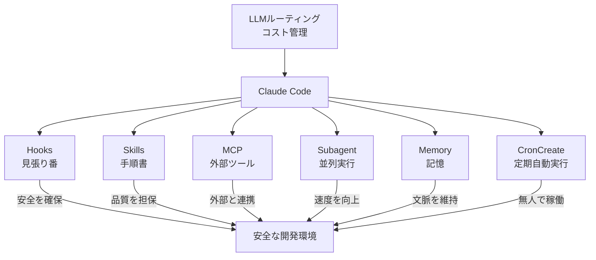
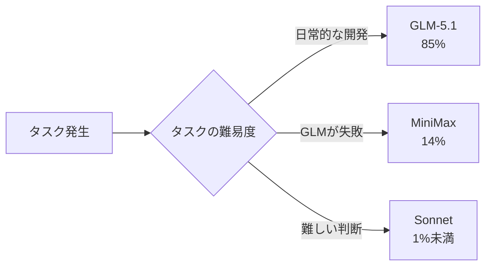
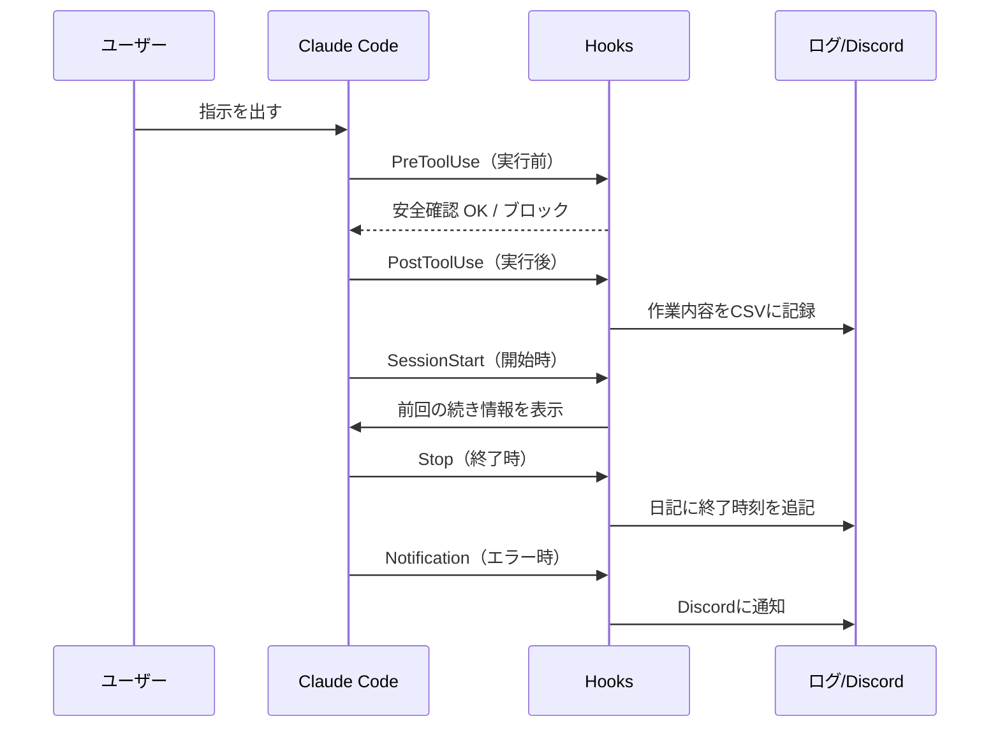
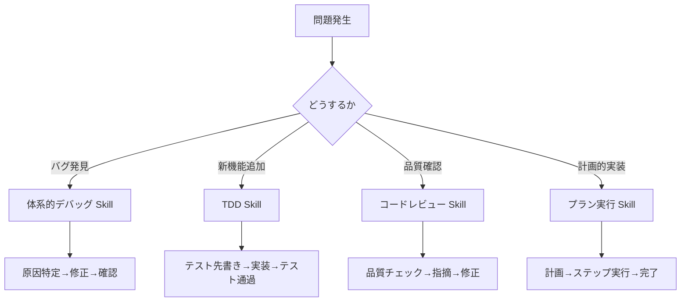
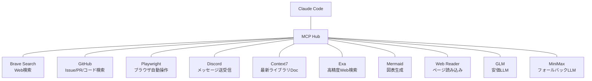
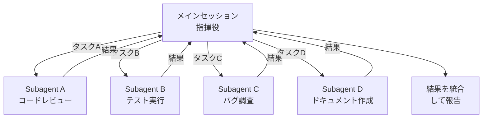
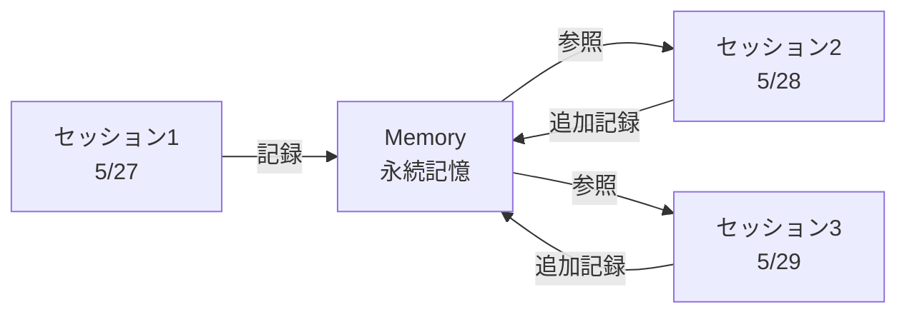
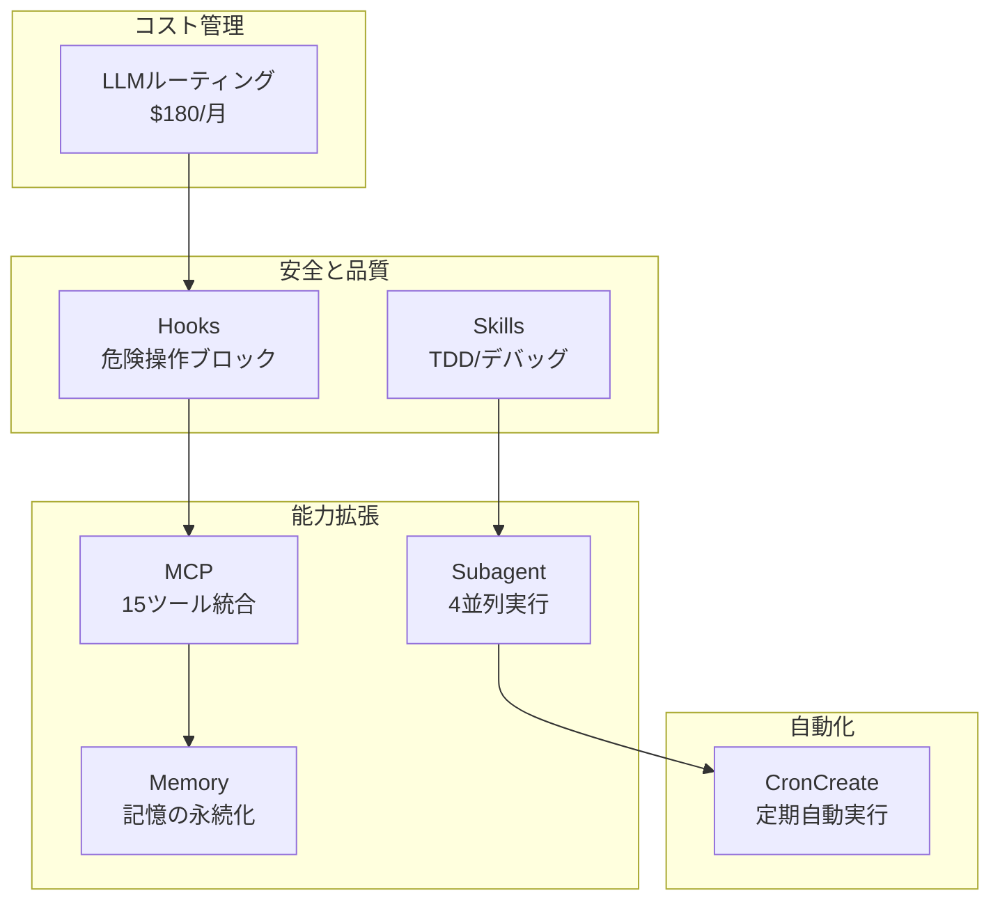

## はじめに

Claude Codeを使っていますか？

多くの人は「チャットでコードを書いてもらうツール」として使っていると思います。でも、Claude Codeには**Hooks、Skills、MCP、Subagent、Memory、CronCreate**という6つの拡張機能が用意されています。

これらを組み合わせると、Claude Codeは単なる「AIコーディングツール」から**「24時間自動で開発を続けるシステム」**に変わります。

私は非ITの公務員ですが、この7つの仕組み（LLMルーティングを含む）を組み合わせることで、1人で20以上のプロジェクトを同時開発・運用しています。月額コストは$180です。

本記事では、それぞれの仕組みを「何ができるか」「どう役立つか」を図解付きで紹介します。

## 全体図

7つの仕組みの関係はこのようになっています。

では、1つずつ解説します。

## 1. LLMルーティング — AIを使い分けてコスト82%削減

Claude Codeは標準だとSonnet（高価）だけを使います。しかし、**普段の開発は安いAIでも十分**なことが多いです。

私は3つのAIを使い分けています。

| AIモデル | 使う割合 | 役割 | コスト感 |
|---|---|---|---|
| GLM-5.1 | 85% | 日常の開発・コード生成 | 安い（通勤用の軽自動車） |
| MiniMax | 14% | GLMが失敗した時の予備 | 安い（代車） |
| Sonnet | 1%未満 | 難しい判断が必要な時だけ | 高い（スポーツカー） |

**結果**: Sonnetだけだと月$1,000以上かかるところを、**$180/月に削減**（82%オフ）。

> 自動車で例えると、GLMは「通勤用の軽自動車」（安くて十分）、MiniMaxは「軽が壊れた時の代車」、Sonnetは「高速道路を飛ばす時のスポーツカー」です。普段は軽で十分ですが、必要な時だけスポーツカーを使います。

## 2. Hooks — 自動で見張る5人の番人

Hooksは「特定のタイミングで自動的にスクリプトを実行する」仕組みです。AIが危険な操作をしようとしたら止めたり、作業ログを自動で取ったりします。

5種類のHooksを設定しています。

| 種類 | タイミング | 何をするか |
|---|---|---|
| **PreToolUse** | ツールを使う**前** | 19種類の危険コマンドをブロック（`rm -rf *`等を防止） |
| **PostToolUse** | ツールを使った**後** | 作業内容をCSVファイルに自動記録 |
| **SessionStart** | セッション開始時 | 前回の続き情報を表示（ハンドオフ） |
| **Stop** | セッション終了時 | 日記に終了時刻を自動追記 |
| **Notification** | エラー発生時 | Discordに通知を送る |

> 工場の「安全管理者」です。作業員が危ない機械を触ろうとしたら止め、作業が終わったら記録を残し、トラブルが起きたら連絡します。

## 3. Skills — 再利用可能な「手順書」

Skillsは「よく使う作業手順をテンプレート化して、いつでも呼び出せる」仕組みです。

| Skill名 | 何をするか |
|---|---|
| **TDD**（テスト駆動開発） | 「テストを先に書く → コードを書く → テストを通す」の流れを自動実行 |
| **体系的デバッグ** | バグを見つけた時の「原因特定→修正→確認」の手順をなぞる |
| **コードレビュー** | コードの品質をチェックする手順書 |
| **プラン執行** | 計画を立てて、1つずつ確実に実行する |

> 料理の「レシピ集」です。「カレーを作る時はこの手順」「パスタを作る時はこの手順」と決めておけば、毎回ゼロから考えなくて済みます。

## 4. MCP — 15の外部ツールを1カ所に統合

MCP（Model Context Protocol）は、Claude Codeから他のサービスを直接操作できる仕組みです。

| ツール | 何ができるか |
|---|---|
| **Brave Search** | Web検索して最新情報を取得 |
| **GitHub** | Issue作成、PR確認、コード検索 |
| **Playwright** | ブラウザを自動操作してスクリーンショット撮影 |
| **Discord** | メッセージ送受信、通知 |
| **Context7** | 最新のライブラリドキュメントを取得 |
| **Exa** | 精度の高いWeb検索 |
| **GLM / MiniMax** | 安価なLLMをツールとして呼び出し |

> 「万能リモコン」です。TV、エアコン、照明等、別々のメーカーの機器を1つのリモコンで操作できるようなもの。

## 5. Subagent — 複数の作業を4つ同時に実行

Subagentは「独立した複数のタスクを、4つ同時に別々のAIに頼める」仕組みです。

自分が1つずつ順番にやると4時間かかる作業が、4つ同時に進めれば**1時間で終わります**。

実際の使い方の例：
- 「コードレビュー」と「テスト実行」と「バグ調査」を同時に頼む
- 3つのプロジェクトのコードレビューを同時に実行
- 技術調査を3方向に同時に並行探索

> 「4人の部下に同時に別の仕事を頼む」ようなものです。

## 6. Memory — セッションをまたいで覚えている

Memoryは「前のセッションで話した内容を、次のセッションでも覚えている」仕組みです。

Claude Codeはセッションを閉じると会話を忘れます。しかし、Memoryに記録しておけば、**次に開いた時に「この前ここまでやった」と引き継げます**。

3種類の記憶を保存しています。

| 種類 | 何を覚えているか | 具体例 |
|---|---|---|
| **ユーザー情報** | 属性や好み | 「結論ファーストが好き」「専門用語は初出時に説明」 |
| **フィードバック** | 過去に指示した方針 | 「featureブランチ禁止」「settings.json変更時はSSOTも更新」 |
| **プロジェクト** | 進行中の作業の文脈 | 「NexusCoreはv8.2.5」「reserve-optimizerはPhase 4-3完了」 |

> 毎回違うバイトの店員が来るコンビニで、「いつもの」と言うだけで通じるシステム。店員は毎日代わるけど、お客さんの好みは記録されています。

## 7. CronCreate — 人が寝ている間も開発が進む

CronCreateは「指定した時刻に、AIが自動でタスクを実行する」仕組みです。

```mermaid
gantt
    title 1日の自動タスクスケジュール（例）
    dateFormat HH:mm
    axisFormat %H:%M
    
    section 5分ごと
    SSOT自動コミット    :active, s1, 00:00, 24h
    
    section 毎時
    NexusCore自律開発   :n1, 00:23, 1h
    atelier-kyo自律開発 :a1, 00:07, 1h
    
    section 毎日
    日記テンプレート生成 :d1, 00:00, 1m
    
    section 週3回
    ナレッジリント       :l1, 03:03, 1h
```

実際に稼働している自動タスク：

| スケジュール | 何をするか |
|---|---|
| **5分ごと** | ドキュメントの自動コミット＆push |
| **毎時** | 各プロジェクトの自律開発ループ |
| **毎日0時** | その日の日記テンプレートを自動生成 |
| **週3回** | ナレッジリント（情報の整合性チェック） |

> 「工場の夜勤」です。日中は人間が指示を出し、夜間は自動で工場が動き続ける。朝起きたら、夜の間に部品ができあがっている状態。

## まとめ：7つを組み合わせるとどうなるか

| 状況 | 何が起こるか |
|---|---|
| 開発中 | GLMが安くコード生成 → Hooksが危険操作を防止 → Memoryが文脈を維持 |
| 作業を分けたい時 | Subagentが4つ同時に別タスクを実行 |
| 調べたい時 | MCPがWeb検索・GitHub検索・ブラウザ操作を即座に実行 |
| 決まった手順 | Skillsが「TDD」「デバッグ」等の手順を確実に実行 |
| 夜間・外出中 | CronCreateが自動で定期タスクを実行 |
| コスト管理 | LLMルーティングが$180/月に抑える（通常$1,000+） |

**結果**: 1人で20以上のプロジェクトを同時に開発・運用できる環境が完成しています。

## おわりに

Claude Codeは「チャットでコードを書くツール」では終わりません。Hooks、Skills、MCP、Subagent、Memory、CronCreateを組み合わせることで、**一人開発者でも小規模な開発チームに匹敵する生産性**を引き出せます。

特に重要なのは**LLMルーティング**です。安いAIをメインに使うことで、コストを抑えながら大量の開発を回し続けることができます。

「AIツールは高いから…」と諦めている方は、ぜひルーティングの導入を検討してみてください。$180/月でも、ここまでできるということの参考になれば幸いです。

---

**関連記事**:
- [AIにコードを書かせ続けた結果起こった悲劇](https://zenn.dev/fukukei23/articles/ai-coding-governance-collapse) — ガバナンス崩壊＆立て直し記録
- [コードを書かずに20個のプロジェクトを作った話](https://zenn.dev/fukukei23/articles/vibe-coding-civil-servant-20-projects) — Vibe Coding 1年の記録
- [Claude Code CLIにMiniMaxをフォールバックとして組み込んだ話](https://zenn.dev/fukukei23/articles/claude-code-minimax-fallback) — LLMルーティングの技術詳細

**ガイド版**: [Claude Code 武器庫ガイド](https://fukukei23.github.io/guides/claude-code-arsenal/)（クイックリファレンス版）
