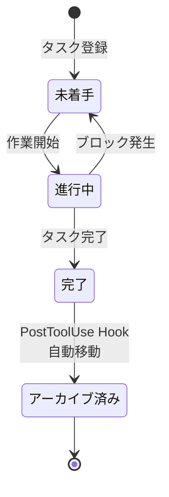

## はじめに

Claude Codeを複数ウィンドウで同時に使っていると、「あれ、何をやろうとしてたっけ？」と忘れることが頻発します。

本記事では、**SessionStart hooks + バックログ** でセッションまたぎのタスク忘れを防ぐ仕組みを解説します。

## 問題: マルチセッションの課題

```
ウィンドウ1: NexusCoreの開発中
ウィンドウ2: バグ修正中
ウィンドウ3: Zenn記事の執筆中
→ ウィンドウ1に戻った時、「何してたっけ？」
```

## バックログ状態遷移



## 解決策: 3つのコンポーネント

### 1. バックログファイル

`00_SYSTEM/バックログ.md` にタスクを駐車:

```markdown
## P0: 今すぐやるべき
- [ ] Zenn GitHub連携復旧 — サポート返信待ち

## P1: 近いうちにやる
- [ ] tweetly XアカウントOAuth認証 — ブラウザ操作必要

## P2: いつかやる
- [ ] WSL版Obsidian起動ショートカット作成

## 完了済み
- [x] NexusCore完全クリーンアップ（5/23完了）
```

### 2. SessionStart Hook

セッション開始時にバックログを自動読み込み:

```bash
# load-obsidian-log.sh（一部抜粋）
BACKLOG="$SSOT_PATH/00_SYSTEM/バックログ.md"
if [[ -f "$BACKLOG" ]]; then
    echo "--- バックログ（未完了タスク） ---"
    awk '/^## P[0-2]:/{section=$0; next}
         /^## 完了済み/{section=""}
         /^\- \[ \]/{print section " → " $0}' "$BACKLOG"
    echo "--- /バックログ ---"
fi
```

### 3. PostToolUse Hook（自動アーカイブ）

完了タスクを自動的に完了済みセクションに移動:

```python
# archive-backlog-done.py
# バックログファイルの編集時に [x] 行を検出
# → 完了済みセクションに自動移動
```

## トリガー: バックログへの追記タイミング

| トリガー | 例 | 動作 |
|---------|-----|------|
| 自動 | セッション終了時に未解決問題あり | Step 4で自動追記 |
| 明示 | 「バックログに入れて」「残タスク」 | 即追加 |

## 設定方法

### settings.json

```json
{
    "hooks": {
        "SessionStart": [{
            "type": "command",
            "command": "~/.claude/scripts/session/load-obsidian-log.sh"
        }],
        "PostToolUse": [{
            "type": "command",
            "command": "python3 ~/.claude/scripts/session/archive-backlog-done.py",
            "matcher": "Edit|Write"
        }]
    }
}
```

### CLAUDE.md の記録ルール

```markdown
### Step 4: バックログの更新（未解決問題がある場合）
- Step 3で「未解決:」があった場合
- ユーザーが「バックログに入れて」等の指示を出した場合
```

## 運用結果

- 未完了タスクの消失: **0件**（導入後）
- セッション開始時の認知負荷: **大幅減少**
- バックログ項目数: P0:3 / P1:5 / P2:10

## まとめ

1. **バックログファイル** にタスクを駐車
2. **SessionStart hook** で自動読み込み
3. **PostToolUse hook** で自動アーカイブ
4. **記録ルール** で追記タイミングを明確化

---

*この記事はClaude Code（GLM-5.1）と一緒に書きました。*
