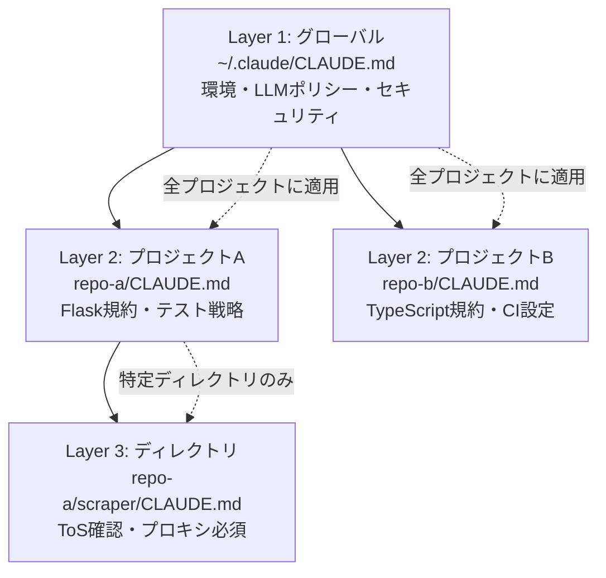

## はじめに

Claude Codeの設定ファイル `CLAUDE.md` は、配置場所によって**スコープが変わります**。この3層構造を意識して設計すると、プロジェクト間の設定管理が劇的に楽になります。

## 3層構造

```
Layer 1: ~/.claude/CLAUDE.md          ← グローバル（全プロジェクト共通）
Layer 2: <repo>/CLAUDE.md             ← プロジェクト（リポジトリ固有）
Layer 3: <repo>/<dir>/CLAUDE.md       ← ディレクトリ（必要時のみ）
```



| 層 | スコープ | 適用タイミング |
|----|---------|---------------|
| Layer 1 | 全プロジェクト | 常に読み込み |
| Layer 2 | リポジトリ単位 | 該当リポジトリ作業時 |
| Layer 3 | ディレクトリ単位 | 該当ディレクトリ作業時 |

## Layer 1: グローバル設定

全プロジェクトで共通するルール:

```markdown
## 環境
- WSL2 Ubuntu / タイムアウト: 10分

## 基本ルール
- 丁寧な日本語で回答
- 実装前に既存コードを理解する（Think Before Coding）

## LLM利用ポリシー
- メイン: GLM-5.1
- フォールバック: MiniMax

## セキュリティ
- APIキー値を会話・ファイルに書き込まない
```

**何を入れるか**: 環境依存しないルール・LLMポリシー・セキュリティルール・ブランチ運用

## Layer 2: プロジェクト設定

リポジトリ固有のルール:

```markdown
## プロジェクト概要
- Flask物販管理システム
- テスト: pytest

## コーディング規約
- 日本語コメント禁止（変数名は英語）
- エラーハンドリングは Service 層で統一

## ディレクトリ構造
- app/routes/ — Blueprint
- app/services/ — ビジネスロジック
- app/models/ — SQLAlchemy Models
```

**何を入れるか**: プロジェクト概要・コーディング規約・ディレクトリ構造

## Layer 3: ディレクトリ設定

特定ディレクトリでのみ必要なルール（必要時のみ）:

```markdown
## このディレクトリの注意点
- スクレイピングコード: 対象サイトのToSを確認すること
- プロキシ経由でアクセスすること
```

**何を入れるか**: ディレクトリ特有の制約・注意事項

## 設定の同期

グローバル設定は複数場所に存在:

```
~/.claude/CLAUDE.md                                    ← 実行環境
obsidian-ssot/01_DECISIONS/claude-code/設定ファイル/    ← 履歴管理
```

変更時は**両方を更新**。obsidian-ssot側で変更履歴を管理。

## よくある間違い

### 間違い1: グローバルにプロジェクト固有ルールを書く

```markdown
# ❌ ~/.claude/CLAUDE.md に書くべきではない
## atelier-kyo-manager
- Flask アプリケーション
- テスト: pytest
```

→ 全プロジェクトに適用されてしまう。

### 間違い2: プロジェクト設定に環境依存情報を書く

```markdown
# ❌ リポジトリの CLAUDE.md に書くべきではない
## API Keys
- MINIMAX_API_KEY=xxx  ← 値は書かない
```

→ 環境変数や secrets.env で管理。

### 間違い3: Layer 3を多用する

```markdown
# ❌ 全ディレクトリに CLAUDE.md を配置
src/CLAUDE.md
src/models/CLAUDE.md
src/routes/CLAUDE.md
tests/CLAUDE.md
```

→ 情報が散在して管理不能に。Layer 3は**本当に必要な時だけ**。

## まとめ

| 層 | スコープ | 何を入れるか |
|----|---------|-------------|
| Layer 1 | 全プロジェクト | 環境・LLMポリシー・セキュリティ |
| Layer 2 | リポジトリ | プロジェクト概要・規約・構造 |
| Layer 3 | ディレクトリ | ディレクトリ特有の制約（最小限） |

## 関連記事

- [シークレット管理インシデントから学ぶClaude Code安全運用](./claude-code-secret-management-incident) — APIキー漏洩防止の多層防御
- [Claude Codeバックログ管理をHooksで自動化](./claude-code-backlog-management-hooks) — タスクの自動読み込み・アーカイブ
- [WSL2 + tmuxでClaude Codeを常時稼働](./wsl2-tmux-claude-code-always-on) — 開発環境の常時稼働構成
- [Context Engineering入門 — 47KBの正体と対策](./context-engineering-47kb-tool) — コンテキスト最適化の基礎

---

*この記事はClaude Code（GLM-5.1）と一緒に書きました。*
