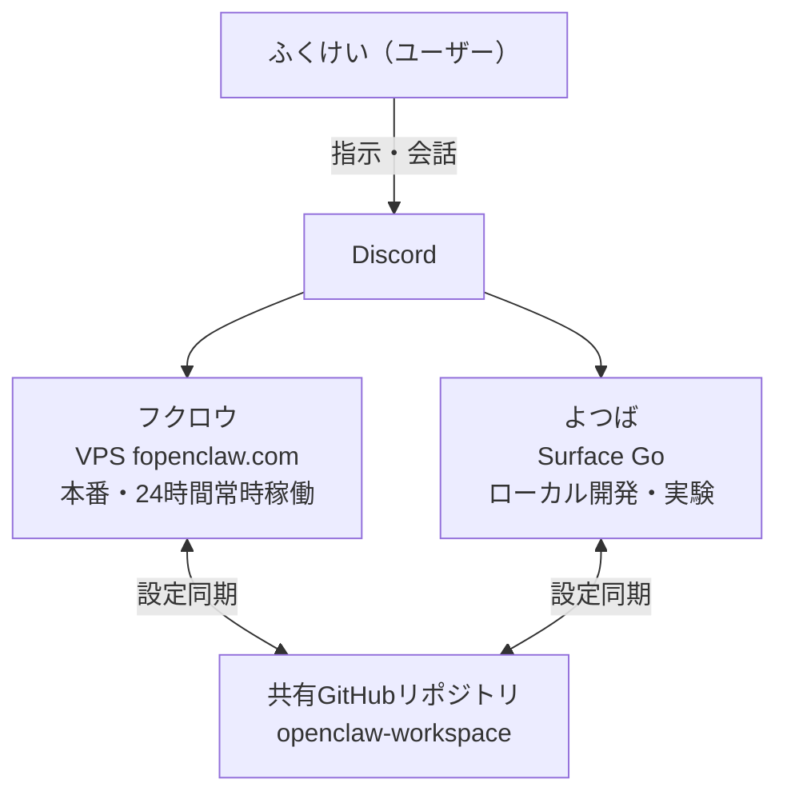

## はじめに

Claude Codeユーザーなら「AIとペアプロする」体験は知っているはず。

でも「AIに24時間働いてもらう」体験は？

私はClaude Code（開発）+ OpenClaw（24時間執事）の二刀流で運用している。この記事では両方を本格運用してみてわかった違いと連携のコツを書く。

## 2つのツールの役割

### Claude Code = 開発の相棒

- CLIベースのAIコーディングアシスタント
- ターミナルで起動 → コードを書く/直す/リファクタする
- セッション中だけ稼働。終わったら寝る
- 得意: コード生成、バグ修正、テスト、リファクタ、Git操作

### OpenClaw = 24時間AI執事

- オープンソースの個人用AIアシスタント（37万スター）
- VPS上で常時稼働。チャットアプリ（Discord等）と統合
- Heartbeat/Cronで定期タスクを自動実行
- 得意: 定期監視、ニュース収集、要約、通知、バックアップ

### 比較表

| 項目 | Claude Code | OpenClaw |
|---|---|---|
| 稼働形態 | セッション中のみ | 24時間常時 |
| 主な用途 | コーディング | 自動化・監視 |
| インターフェース | CLI（ターミナル） | チャットアプリ |
| 設定ファイル | CLAUDE.md | ソウル.md / エージェント.md |
| 記憶 | コンテキストウィンドウ + memory | メモリ.md + 日次ログ |
| スキル | superpowers(plugin) | skills/agency-agents |
| 定期実行 | なし（手動起動） | Heartbeat + Cron |
| 料金 | $220/月(Max) or API従量 | 無料(OSS) + LLM API従量 |
| LLM | Anthropic Claude | 任意（GLM/GPT等） |

## LLMルーティングは共通

両方ともGLM-5.1をメインに使用。

- **Claude Code**: GLM-5.1（glm_ask経由）+ MiniMaxフォールバック
- **OpenClaw**: GLM-5（primary）+ GLM-4.7（fallback）+ GPT-5.1（secondary fallback）

z.ai経由でAnthropic互換APIを使うことでコストを大幅削減。このLLMルーティングの知見は両方で活きる。

## 設定ファイル比較

### Claude Code: CLAUDE.md

- `~/.claude/CLAUDE.md` にグローバルルール
- プロジェクトごとに `<repo>/CLAUDE.md` も配置可能
- 内容: 基本ルール、コーディング原則、セキュリティ、記録ルール
- 特徴: 開発に特化。コーディング規約、ブランチ運用、テスト方針等

### OpenClaw: ソウル.md + エージェント.md + ユーザー.md

- `ソウル.md`: エージェントの性格・哲学
- `エージェント.md`: セッション開始時の手順、メモリ管理ルール
- `ユーザー.md`: ユーザー情報、コミュニケーションスタイル
- `ハートビート.md`: 定期タスクの定義
- 特徴: 生活全般に対応。性格・記憶・定期実行まで

**共通点**: どちらも「テキストファイルでAIに指示する」という思想。Markdownで書く。Git管理できる。

## スキルシステム比較

### Claude Code: superpowers (plugin)

- スキルマーケットからインストール
- brainstorming, debugging, frontend-design, mcp-builder等
- 開発ワークフローに特化

### OpenClaw: skills (agency-agents)

- `skills/` ディレクトリに配置
- 49体の専門エージェント: design(5) / engineering(25) / marketing(8) / specialized(24) / testing(?)
- 各エージェントは `SKILL.md` で役割を定義
- 生活・仕事全般に対応（デザイン、マーケティング、テスト等）

**違い**: Claude Codeのスキルは「開発プロセス支援」、OpenClawのエージェントは「業務全般の代行」。

## 具体的な1日のワークフロー

### 朝（6:00〜9:00）

- **OpenClaw**: 朝の天気通知（morning_weather.py）
- **OpenClaw**: 夜間のDiscord会話スキャン結果を確認
- **OpenClaw**: AIニュースダイジェスト（ai_news_digest.py）

### 日中（9:00〜18:00）

- **Claude Code**: メインの開発作業（コーディング、テスト、PR作成）
- **OpenClaw**: 30分おきにDiscordを監視（TODO抽出・リマインド）
- **OpenClaw**: 5分おきに設定ファイルのヘルスチェック

### 夜（18:00〜22:00）

- **Claude Code**: その日の作業を記録（SSOT日記更新）
- **OpenClaw**: YouTube動画要約（ai_youtube_digest.py）
- **OpenClaw**: 日次サマリー生成（daily_summary.py）

### 深夜（22:00〜6:00）

- **OpenClaw**: 静穏モード（スキャンスキップ）
- **OpenClaw**: 04:00 ワークスペースバックアップ（backup_workspace.sh）
- **OpenClaw**: 08:00 Obsidian日次ノート更新（update_daily_note.py）

```mermaid
flowchart LR
    subgraph Morning["朝 6:00-9:00"]
        M1["天気通知"]
        M2["Discord夜間スキャン"]
        M3["AIニュースダイジェスト"]
    end

    subgraph Daytime["日中 9:00-18:00"]
        D1["Claude Code<br/>メイン開発"]
        D2["30分おきDiscord監視"]
        D3["5分おきヘルスチェック"]
    end

    subgraph Evening["夜 18:00-22:00"]
        E1["Claude Code<br/>SSOT日記更新"]
        E2["YouTube要約"]
        E3["日次サマリー"]
    end

    subgraph Night["深夜 22:00-6:00"]
        N1["静穏モード"]
        N2["04:00 バックアップ"]
        N3["Obsidian更新"]
    end

    Morning --> Daytime --> Evening --> Night
```



## 2台運用の実態

- **フクロウ**: VPS（fopenclaw.com）で本番稼働。24時間安定動作が目的
- **よつば**: Surface Go（ローカル）で開発・実験用。自走ビジネスの実験環境
- **共有GitHubリポジトリ**: `openclaw-workspace`（プライベート）で設定を同期
- **引き継ぎプロンプト**: `LLM引き継ぎプロンプト_YYYY-MM-DD.md` でセッションをまたぐ

### システム構成図

```
[ふくけい（ユーザー）]
      ↓ Discord
[fopenclaw サーバー]
      ↓               ↓
[フクロウ（VPS）]  [よつば（Surface Go）]
 XXX.XXX.XXX.XXX      192.168.x.x
 本番・常時稼働     ローカル開発・実験
```



## 連携の実例

- OpenClawがObsidian日次ノートを更新 → Claude CodeがSSOT日記を読んで開発継続
- Claude Codeが作ったスクリプトをOpenClawのHeartbeatに組み込む
- 共通のLLMルーティング設定（GLM-5.1メイン）を両方で運用
- セキュリティポリシー（APIキーの取り扱い）も共通

## 向いている人 / 向かない人

### Claude Code単体で十分な人

- 開発メインで定期タスクが不要な人
- VPS運用に興味がない人
- コーディングだけに集中したい人

### OpenClaw単体で十分な人

- 開発をしない人（情報収集・自動化メイン）
- チャットベースのAIで満足な人
- コーディング機能は不要な人

### 二刀流がおすすめな人

- 個人開発 + 自動化の両方をやりたい人
- AIに24時間働かせつつ、自分も開発したい人
- コストを抑えつつ最大限AIを活用したい人

## まとめ

- Claude CodeとOpenClawは競合ではなく「補完関係」
- Claude Code = 開発の相棒 / OpenClaw = 24時間執事
- LLMルーティング、設定ファイルの思想、スキルシステムは共通の概念
- 「使い分ける」だけでなく「連携させる」のがポイント
- どちらもMarkdownでAIに指示する「テキストベースのAI制御」という共通の哲学がある

## 関連記事

- [公務員がOpenClawで24時間AI執事「フクロウ」を作った3ヶ月の記録](./openclaw-24h-owl-butler-3months) — OpenClaw運用全体の概要
- [OpenClaw × GLM-5で月額コストを抑えた24時間AIアシスタント運用](./openclaw-glm5-cost-optimization-24h) — 3モデル使い分けとコスト計算
- [AIエージェントにソウルを与える：OpenClawのカスタマイズ徹底解説](./openclaw-soul-memory-customization) — CLAUDE.mdとソウル.mdの比較も掲載
- [VPS + Docker + Caddy + OpenClaw：インフラ構築](./openclaw-vps-docker-caddy-infrastructure) — 二刀流の基盤となるVPS構築手順
- [OpenClaw Heartbeat設計：AIに定期的にお仕事をさせる仕組み](./openclaw-heartbeat-cron-automation) — 1日のワークフローを支えるHeartbeat詳細

---

*この記事はClaude Code（GLM-5.1）と一緒に書きました。*
