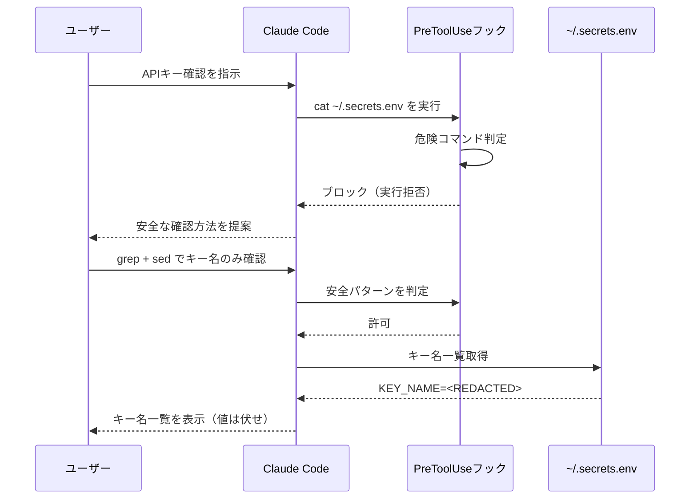

## はじめに

Claude Codeは便利ですが、**APIキーを間違えて会話に露出させるリスク**があります。

私は実際にAPIキー露出インシデントを経験し、それをきっかけにセキュリティフックを強化しました。

本記事では、Claude Codeでのシークレット管理の**実践的な安全パターン**を解説します。

## APIキー露出の3つの経路

### 経路1: ファイル読み取り

```bash
# ❌ Claude Codeが実行するとAPIキーが会話に表示される
cat ~/.claude/settings.json
```

### 経路2: 環境変数の表示

```bash
# ❌ 全環境変数を表示
env | grep API
```

### 経路3: jqで設定ファイルをダンプ

```bash
# ❌ 2024年の私の設定では「jqで確認してください」と推奨していた
jq . ~/.claude/settings.json  # APIキーが含まれる
```

## 安全パターン（唯一の安全な確認方法）

### APIキーの存在確認

```bash
# ✅ キーが設定されているかだけ確認
[ -n "$MINIMAX_API_KEY" ] && echo "set" || echo "unset"
```

### キー名一覧

```bash
# ✅ キー名だけ表示、値は伏せ
grep -E "^[A-Z_]+=" ~/.secrets.env | sed "s/=.*/=<REDACTED>/"
```

### 長さ確認

```bash
# ✅ 長さだけ確認
echo "len=${#MINIMAX_API_KEY}"
```

## シークレット漏洩から検出・修正までの流れ



## 3層防御の実装

### 第1層: PreToolUseフック（技術的強制）

Claude Codeがコマンドを実行する**前に**チェック:

```python
# check-command-safety.py
BLOCKED_COMMANDS = ["cat", "head", "tail", "less", "more"]
BLOCKED_PATTERNS = [
    r"\.env$",           # .envファイル
    r"credentials",      # 認証情報ファイル
    r"secrets",          # シークレットファイル
]

def check_safety(command: str) -> bool:
    for cmd in BLOCKED_COMMANDS:
        if cmd in command:
            target = extract_target(command)
            for pattern in BLOCKED_PATTERNS:
                if re.search(pattern, target):
                    return False  # ブロック
    return True  # 許可
```

### 第2層: jq ブロック（ギャップ修正）

初期実装では `jq` がブロック対象外でした:

```python
# 追加したセキュリティルール
ALLOWED_JQ_QUERIES = [
    ".statusLine",
    ".model",
    ".permissions",
    "*.command",
]

BLOCKED_JQ_QUERIES = [
    ".",           # 全ダンプ
    ".mcpServers", # APIキー含む
    ".env",        # 環境変数
]
```

### 第3層: ~/.secrets.env への集約

```bash
# ~/.secrets.env（単一ファイルに集約）
MINIMAX_API_KEY=xxx
GLM_API_KEY=xxx
BRAVE_API_KEY=xxx
GITHUB_TOKEN=xxx

# 各プロジェクトの.envには書かない
# 必要に応じて source ~/.secrets.env で注入
```

## 設定ファイルのAPIキー管理

### ❌ 悪い例: settings.jsonに直書き

```json
{
    "mcpServers": {
        "brave-search": {
            "env": {
                "BRAVE_API_KEY": "BSA-abc123..."  // ← 露出リスク
            }
        }
    }
}
```

### ✅ 良い例: 環境変数経由で注入

```bash
# ~/.claude/scripts/session/startup.sh（SessionStart hook）
source ~/.secrets.env
export BRAVE_API_KEY
export GITHUB_TOKEN
```

settings.json側は `env` セクションに値を書かない:

```json
{
    "mcpServers": {
        "brave-search": {
            "env": {
                "BRAVE_API_KEY": ""  // ← 空文字、環境変数から注入される
            }
        }
    }
}
```

## インシデント対応フロー

万が一APIキーが露出した場合:

```
1. 即座に会話を終了
2. 露出したキーをローテーション（新しいキーを発行）
3. ~/.secrets.env を更新
4. SSOTにインシデント記録（値は記載しない）
5. 原因を分析してフックを追加
```

## まとめ

| 防御層 | 役割 | 実装 |
|--------|------|------|
| PreToolUseフック | 危険コマンドの実行前ブロック | Python スクリプト |
| jqブロック | 設定ファイルの不正ダンプ防止 | ホワイトリスト方式 |
| secrets.env集約 | キーの単一管理 | 環境変数注入 |

**APIキーの値を絶対に会話・ファイルに書き込まない**——これが唯一の安全なルールです。

## 関連記事

- [Claude Code設定の3層設計 — CLAUDE.mdをどう分割するか](./claude-code-claude-md-3-layer-design) — グローバル/プロジェクト/ディレクトリの使い分け
- [Claude Codeバックログ管理をHooksで自動化](./claude-code-backlog-management-hooks) — タスク管理の自動化で認知負荷を下げる
- [Webhook署名検証をタイミングセーフに実装する](./webhook-hmac-timing-safe-implementation) — HMAC検証の正しい実装方法
- [STRIDE脅威モデリングを個人開発に導入](./stride-threat-modeling-personal-projects) — 個人プロジェクトのセキュリティ分析

---

*この記事はClaude Code（GLM-5.1）と一緒に書きました。*
