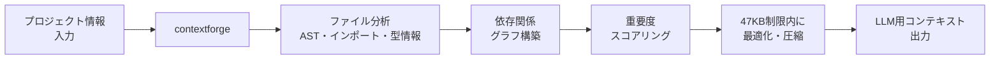

## はじめに

2026年、AI開発界隈で最も注目されている概念——**Context Engineering（コンテキストエンジニアリング）**。

「プロンプトエンジニアリングは死んだ。これからはContext Engineeringだ」と言われるようになっています。

本記事では、私が作った **contextforge** という47KBの単一Pythonファイルを使って、Context Engineeringを実践する方法を解説します。

## Context Engineeringとは

**プロンプトエンジニアリング**: LLMに送る「指示文」を最適化する
**Context Engineering**: LLMに送る「全体コンテキスト」を最適化する

違いを例で説明:

```
❌ プロンプトエンジニアリング:
「コードをレビューして」

✅ Context Engineering:
・対象ファイルのコード（500行）
・プロジェクトのコーディング規約
・過去の類似レビュー結果
・現在のブランチの差分
上記を最適な順序・量でLLMに投入
```

Context Engineeringは**「何を聞くか」ではなく「何を見せるか」**を設計する技術です。

## contextforgeの設計思想

### なぜ47KBの単一ファイルなのか

```python
# contextforge — 決定論的LLM入力アーティファクト生成
# 全てが1ファイルに収まっている
$ wc -c contextforge.py
47000
```

理由は3つ:
1. **LLMに投げやすい** — 1ファイルならコンテキストに載せやすい
2. **依存関係ゼロ** — `pip install` 不要、`python contextforge.py` で即動く
3. **決定論的** — 同じ入力→同じ出力。LLMのランダム性に依存しない

### アーキテクチャ



## 実践: コードレビューでの使用例

### Before（非エンジニアのレビュー指示）

```
このコードレビューして
```

→ LLMは文脈不足で的外れなレビューを返す

### After（contextforge使用）

```python
from contextforge import ContextForge

cf = ContextForge(project_root="/path/to/project")

# プロジェクト全体から関連コンテキストを自動抽出
context = cf.generate(
    target_files=["app/services/price_scraper.py"],
    task="code_review",
    max_tokens=8000  # コンテキストウィンドウに収める
)

# 生成されたコンテキストをLLMに投入
llm.review(context)
```

出力されるコンテキスト:
1. 対象ファイルのコード
2. 関連するモデル・サービスのコード
3. プロジェクト固有のコーディング規約
4. テストコード（品質基準の推測用）

**コンテキストウィンドウに収まるよう、重要度順にカット**されます。

## Context Engineeringの5つの原則

### 1. 関連性フィルタリング

全ての情報を投げない。**タスクに必要な情報だけ**を選択:

```python
# ❌ 全ファイル投げる（無駄が多い）
context = all_files_in_project()

# ✅ 関連ファイルだけ（精度が上がる）
context = cf.filter_related(target="price_scraper.py", depth=2)
```

### 2. 順序の最適化

LLMは**最初と最後の情報をよく覚えています**（primacy/recency effect）:

```python
# 最重要: システムプロンプト（先頭）
# 次に: 対象コード
# 最後に: 具体的な指示
context = cf.order_by_importance(files, task="review")
```

### 3. トークン予算の管理

コンテキストウィンドウには上限があります:

```python
# GPT-4: 128K tokens
# Claude: 200K tokens
# でも長すぎると精度が下がる
context = cf.generate(max_tokens=8000)  # 実用最適サイズ
```

### 4. 構造化されたフォーマット

Markdown構造でLLMが理解しやすい形式に:

```markdown
## Project: atelier-kyo-manager
## Target: price_scraper.py
## Related Models: Product, PriceHistory
## Coding Standards: [抽出済み]
## Test Coverage: [関連テスト]
```

### 5. 再現性の確保

同じ入力→同じコンテキスト。LLMのランダム性と切り離す:

```python
# 決定論的: 入力が同じなら常に同じ出力
context_v1 = cf.generate(target="app.py")
context_v2 = cf.generate(target="app.py")
assert context_v1 == context_v2  # True
```

## テスト駆動で品質担保

contextforge自体もTDDで開発:

```
Phase 0-3 TDD完了
86%カバレッジ
Gradio UIでインタラクティブテスト可能
```

## 他のContext Engineering ツールとの比較

| ツール | アプローチ | 依存関係 | 決定論的 |
|--------|-----------|---------|---------|
| contextforge | 単一ファイル・AST分析 | ゼロ | はい |
| Aider | Git統合・マルチファイル | pip必要 | いいえ |
| Cursor | IDE統合・コンテキスト自動選択 | Electron | いいえ |
| Claude Code | CLI・プロジェクト全体分析 | npm必要 | いいえ |

contextforgeの強みは**依存ゼロ・決定論的・軽量**。CI/CDパイプラインにも組み込みやすいです。

## コード

https://github.com/fukukei23/contextforge

## 関連記事

- [Claude Code設定の3層設計 — CLAUDE.mdをどう分割するか](./claude-code-claude-md-3-layer-design) — コンテキスト最適化の実践設計
- [MCPサーバー15個の断捨離基準](./mcp-15-servers-cleanup-criteria) — コンテキスト圧迫の要因と削減手法
- [SSOT300件の意思決定ログから学んだ教訓](./ssot-300-decision-logs-lessons) — 情報整理のノウハウ

---

*この記事はClaude Code（GLM-5.1）と一緒に書きました。*
