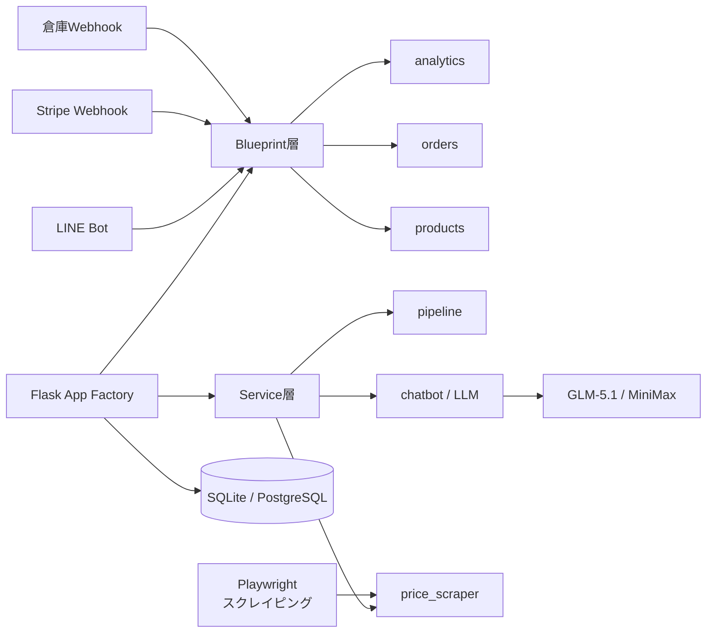
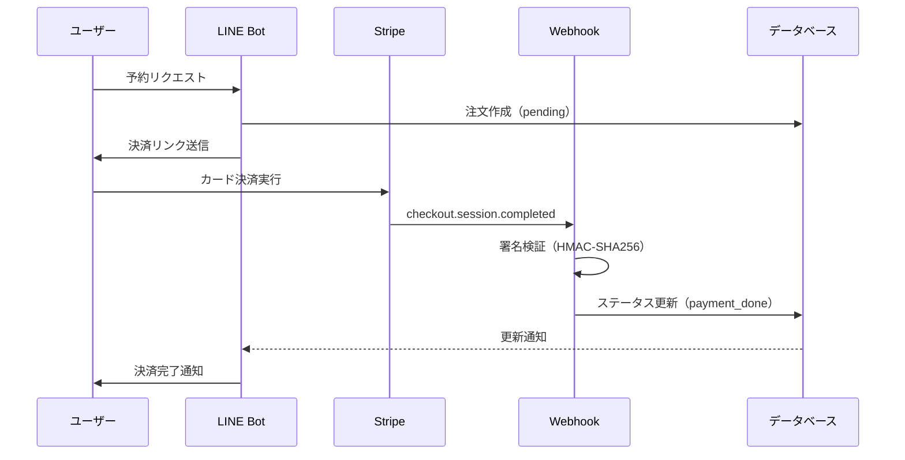

## はじめに

BUYMA（バイマー）とBuyandshipを利用した転売ビジネス。出品・価格調整・発注・顧客対応……全て手作業だと1日が終わりません。

私はこの一連の業務を **Flask Webアプリ + AI/LLM** で自動化するシステムを1人で作りました。

本記事では、この **atelier-kyo-manager** の設計と実装を解説します。

## システム概要

```
atelier-kyo-manager（Flask App Factory）
  ├── Blueprint（6モジュール）
  │     analytics / orders / partners / products / misc / warehouse_webhook
  ├── Service層（8モジュール）
  │     auto_order / chatbot / image / notification / pipeline / price_scraper / template / warehouse_event
  ├── Models（16種 SQLAlchemy）
  └── Utils（20+モジュール）
```

## システムアーキテクチャ



## 主要機能の設計思想

### 1. 出品パイプライン自動化

画像収集 → AI背景除去 → AI説明文生成 → 出品テキスト生成 を一括実行:

```python
# pipeline_service.py — 4ステップを直列実行
class PipelineService:
    def execute(self, product_id: int):
        images = self.image_service.collect(product_id)
        cleaned = self.image_service.remove_background(images)
        description = self.llm.generate_description(cleaned)
        listing = self.format_for_buyma(description)
        return listing
```

**工夫**: rembg（AI背景除去）はGPU不要。CPUで5秒/枚。

### 2. 価格スクレイピング（Playwright）

仕入先サイトの価格をヘッドレスブラウザで自動取得:

```python
# price_scraper.py
class PriceScraper:
    def __init__(self):
        self.browser = playwright.chromium.launch(headless=True)

    async def fetch_price(self, url: str) -> int:
        page = await self.browser.new_page()
        await page.goto(url)
        price = await page.locator(".price").text_content()
        return self._parse_price(price)
```

**工夫**:
- 24時間キャッシュで重複スクレイピング防止
- Cloudflare検出時のエラーハンドリング
- プロキシ（Webshare/BrightData）経由でIP ban回避

### 3. 注文ステートマシン

注文の状態遷移を自動管理:

```
pending → sourcing → cart_added → checkout → payment_done → shipped → completed
```

各状態のタイムアウト・自動エスカレーション付き。18日ルール（決済方法別の延長期限）も自動計算:

| 決済方法 | 延長期限 |
|---------|---------|
| クレジットカード | 45日 |
| 銀行振込 | 90日 |
| コンビニ決済 | 30日 |

### 4. AIチャットボット（3段階分類）

顧客からの問い合わせを自動分類:

```
FAQテンプレートマッチ → AI回答生成 → エスカレーション判定
         ↓                  ↓                ↓
      即自動返信        AI生成返信       手動対応へ
```

**使用LLM**: Gemini → OpenAI → DeepSeek（フォールバック付き）

### 5. 倉庫Webhook連携

Forward2me（転送倉庫）の荷物受領イベントをWebhookで受信:

- **HMAC-SHA256署名検証** でなりすまし防止
- 受領写真の自動ダウンロード・管理
- Slack通知で即座にステータス反映

## テスト戦略

「コードが読めない」のでテストで品質を担保:

```
76 tests passed, 0 failed
```

- auth（10件）・pricing_rules（9件）・run_context（13件）
- product（21件）・config_loader（9件）・notification_service（14件）

## 技術選定の理由

| 技術 | 理由 |
|------|------|
| Flask | 軽量・学習コスト低。AI生成コードと相性良い |
| SQLAlchemy ORM | SQLインジェクション対策。raw SQLを減らす |
| Playwright | Seleniumより安定。ヘッドレス実行が速い |
| SQLite → PostgreSQL | 開発はSQLite、本番はPostgreSQLに切替可能 |
| rembg | AI背景除去がGPU不要で動く |

## 苦労した点

### スクレイピングの安定性
サイトごとにDOM構造が違う。Cloudflareにブロックされる。→ Playwright + プロキシ + キャッシュで安定化。

### LLMコストの管理
月間15億トークン消費。→ GLM-5.1（メイン）+ MiniMax（フォールバック）の2層で最適化。

### 18日ルールの複雑さ
決済方法・発送状況・キャンセル有無で期限が変わる。→ ステートマシンで一元管理。

## 成果

### 予約〜決済フロー



- 出品作業時間: 手動2時間 → 自動15分
- 価格監視: 手動確認 → 自動スクレイピング（1日3回）
- 顧客対応: 全手動 → 70%自動返信
- 月間作業時間: 約50%削減

## コード

https://github.com/fukukei23/atelier-kyo-manager

---

*この記事はClaude Code（GLM-5.1）と一緒に書きました。*
