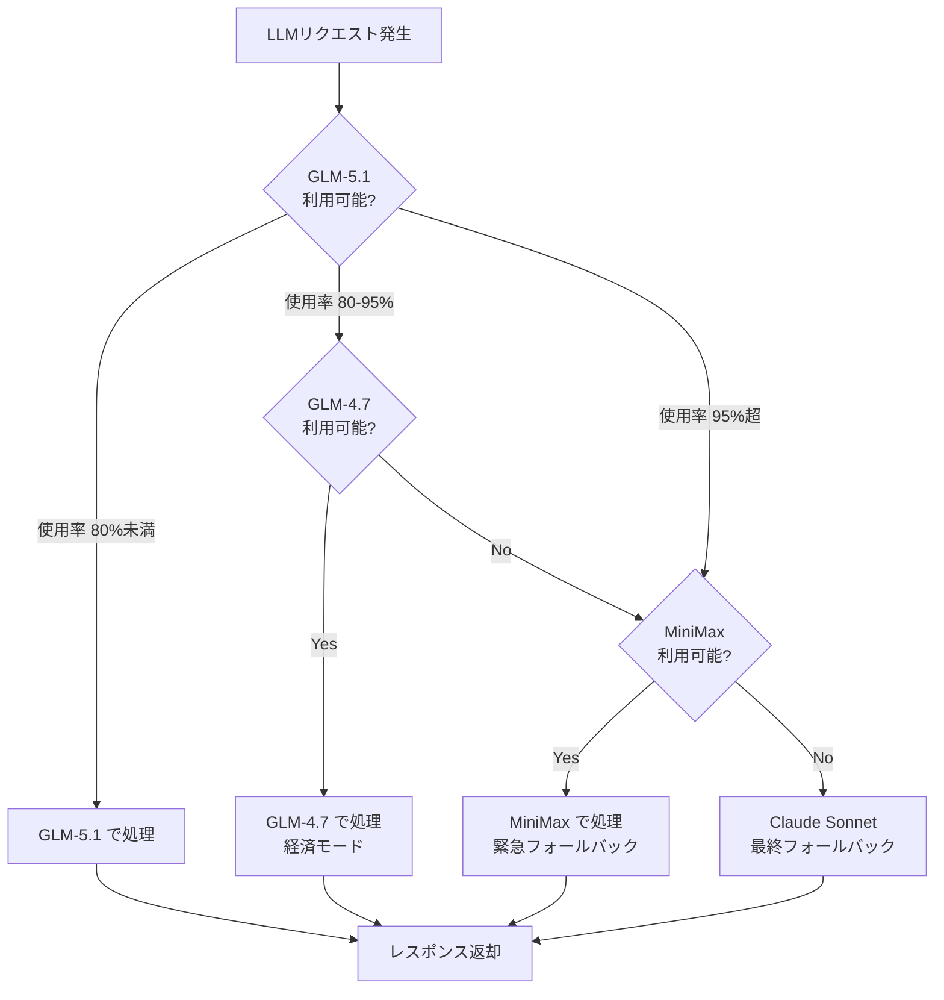

## はじめに

2026年4月、私の開発環境は **月間15億トークン** を消費していました。

これをどうコスト管理しているか——月額 **$380** で。

本記事では、3ヶ月間のLLMルーティング運用で得た知見を、コスト・安定性・設計の3つの観点から解説します。

## LLMルーティングの意思決定フロー



## 利用規模

| 指標 | 数値 |
|------|------|
| 月間トークン消費 | **1,500,000,000+** |
| 日間ピーク | **280,584,009**（2026-04-20） |
| 日平均最低 | **50,000,000+** |
| 同時セッション | 5〜10（Claude Code マルチウィンドウ） |
| 使用リポジトリ | 20+ |

## 3層LLMルーティング

```
                    ┌─────────────────┐
                    │  Claude Code    │
                    │  (メインインターフェース)  │
                    └────────┬────────┘
                             │
                    ┌────────▼────────┐
                    │  glm_rate_proxy │ ← レート制限監視
                    │  (localhost:8787)│
                    └────────┬────────┘
                             │
              ┌──────────────┼──────────────┐
              │              │              │
     ┌────────▼────┐  ┌─────▼─────┐  ┌────▼─────┐
     │ GLM-5.1     │  │ GLM-4.7   │  │ MiniMax  │
     │ (normal)    │  │ (economy) │  │(emergency)│
     │ 使用率 <80% │  │ 80-95%    │  │ 95%+     │
     └─────────────┘  └───────────┘  └──────────┘
```

### 判定ロジック

```python
# glm_rate_proxy のルーティング
if usage < 80%:
    model = "glm-5.1"        # 最高品質
elif usage < 95%:
    model = "glm-4.7"        # 経済モード
else:
    model = "glm-4.7-flash"  # 緊急モード
    if glm_fails:
        model = "minimax-m2.7"  # フォールバック
```

使用率は **Z.AI APIのレスポンスヘッダー** からリアルタイム取得。独自計算ではありません。

## コスト比較（サブスク vs 従量課金）

### サブスク型の比較

| プラン | 月額 | Pro比使用量 | Pro比単価 |
|--------|------|------------|-----------|
| Anthropic Pro | $19 | 1x | $19.00 |
| Anthropic Max | $220 | 20x | $11.00 |
| **z.ai Max** | **$160** | **60x** | **$2.67** |

**z.ai Max の方が Anthropic Max より月額$60安く、使用量は3倍。コスパ約5倍。**

### 私の実際のコスト構成

| サービス | 月額 | 用途 |
|---------|------|------|
| z.ai Max | $160 | メイン開発（GLM-5.1） |
| Anthropic Max | $220 | 複雑な設計・最終確認（Sonnet） |
| **合計** | **$380** | 15億トークン/月 |

### API従量課金だとどうなるか

15億トークンを各社API従量課金で消費した場合:

| プロバイダー | モデル | 月額推定 |
|-------------|--------|---------|
| Anthropic | Sonnet | $99,000+ |
| OpenAI | GPT-4o | $75,000+ |

**サブスクを使う理由が数字で証明できます。**

## 3ヶ月間のインシデント

### インシデント1: 429エラー連発（5月20日）

**原因**: Z.AI APIの5時間制限（5h-window）に到達

```
510リクエスト中:
  429エラー: 108件（21%）
  MiniMaxフォールバック: 60件
```

**対応**:
- レートプロキシが自動的にGLM-4.7-Flash → MiniMaxにフォールバック
- 5時間後に制限リセット → 自動復旧

### インシデント2: 使用率99%固定化（5月20日）

**原因**: レートプロキシのバグ

```python
# バグ: 成功時に使用率を更新せず99%をハードコード
self._tracker.set_usage(99.0)  # ← 常に99%

# 修正: レスポンスヘッダーの実際の使用率で更新
self._tracker.update_from_headers(resp["headers"])
```

制限がリセットされた後も99%のまま → 不要なMiniMax永続化。

**教訓**: レート制限の復旧判定は「時間経過」ではなく「実際の使用率」で判定する必要がある。

### インシデント3: レスポンスヘッダーの不在（設計上の制約）

GLM API（Z.AI）は **Anthropic互換ヘッダーを返さない**:

```python
# Anthropic直結の場合
x-ratelimit-5h-percentage: 45.2%  # ← 取得可能

# GLM API（Z.AI）の場合
# ヘッダーなし ← 取得不可能
```

**対応**: プロキシで使用率をトラッキングし、代替指標として利用。

## レートプロキシの設計

### 自動判定フロー

```
Claude Code起動
  → .bashrc がプロキシ生存確認（curl localhost:8787/proxy/status）
    → 200 OK → プロキシ経由（フォールバックあり）
    → 接続不能 → Z.AI直結（フォールバックなし）
```

プロキシが死んでも **自動でZ.AI直結にフォールバック**。開発が止まることはありません。

### 無効化手順

```bash
pkill -f glm_rate_proxy    # プロキシを止めるだけ
# 次回 Claude Code 起動時に自動でZ.AI直結になる
```

## 運用のベストプラクティス

### 1. 複数LLMの使い分け

| 用途 | 最適モデル | 理由 |
|------|-----------|------|
| 日常開発 | GLM-5.1 | コスパ最強 |
| 要約・変換 | MiniMax | 大量処理向け |
| 複雑な設計 | Claude Sonnet | 推論精度最高 |

### 2. レート制限の監視

- 5時間ウィンドウの使用率をトラッキング
- 80%到達で警告、95%でモデル切替
- ヘッダー情報が無い場合は独自トラッキング

### 3. コスト監視

- 月間トークン消費をダッシュボードで可視化
- プロジェクト別のコスト配分を把握
- サブスク上限に対する使用率を監視

## まとめ

1. **サブスク型LLM**（z.ai）は従量課金より圧倒的に安い
2. **レートプロキシ** でレート制限を自動管理
3. **3層ルーティング** で品質とコストのバランスを最適化
4. **フォールバック設計** で開発が止まらない

15億トークン/月を$380で捌けるのは、サブスク型LLM + 自前ルーティングの組み合わせだからこそです。

---

*この記事はClaude Code（GLM-5.1）と一緒に書きました。*
