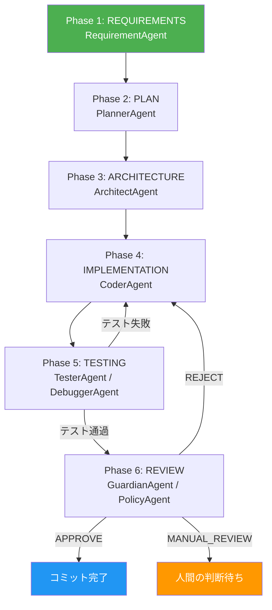
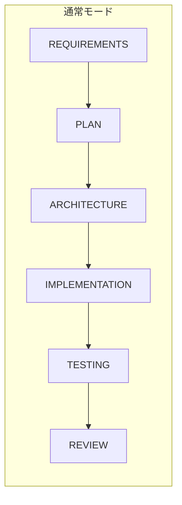
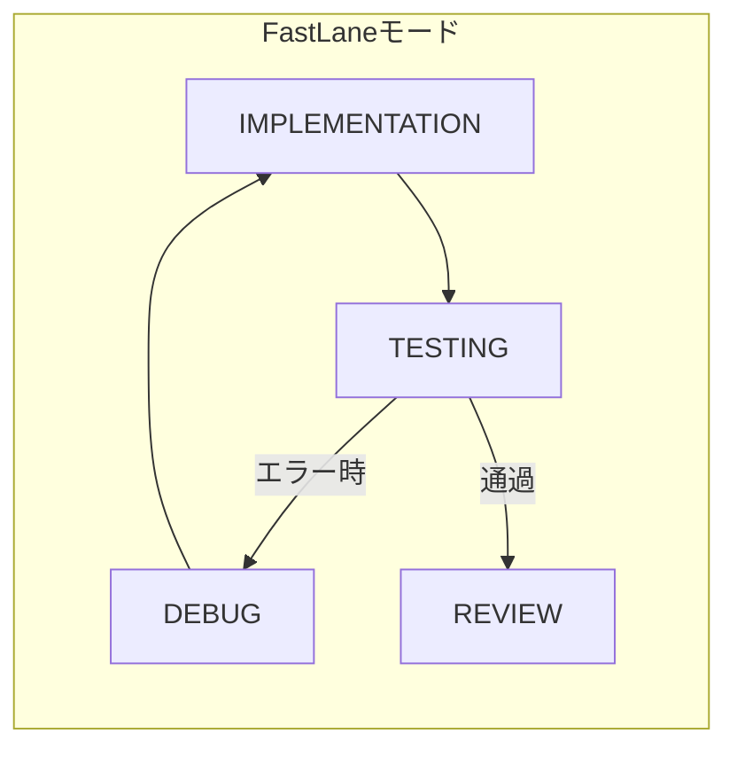

## はじめに

AIエージェントを1つ作ることは、もう珍しくありません。しかし、複数のエージェントを協調させ、1つの開発パイプラインとして動かすには、どういう設計が必要でしょうか。

本記事では、14の専門AIエージェントが6フェーズの開発パイプラインを自律実行するマルチエージェントフレームワーク（NexusCore）の設計を紹介します。

## 全体アーキテクチャ

### エージェント一覧

| エージェント | 役割 | 担当フェーズ |
|---|---|---|
| Orchestrator | 全体制御・パイプライン管理 | 全フェーズ |
| ContextAgent | プロジェクト構成分析・コンテキスト構築 | Phase 0: ANALYSIS |
| RequirementAgent | 要件定義 | Phase 1: REQUIREMENTS |
| PlannerAgent | 実装計画・タスク分解 | Phase 2: PLAN |
| ArchitectAgent | アーキテクチャ設計 | Phase 3: ARCHITECTURE |
| CoderAgent | コード生成（AST検証付き） | Phase 4: IMPLEMENTATION |
| TesterAgent | テスト生成・実行 | Phase 5: TESTING |
| DebuggerAgent | エラー分析・修正生成 | Phase 5: TESTING |
| GuardianAgent | コードレビュー・品質ゲート | Phase 6: REVIEW |
| PostmortemAgent | 失敗分析・知識ベース更新 | エラー発生時 |
| MutationTesterAgent | Mutation Testing | Phase 6: REVIEW |
| PolicyAgent | ポリシー準拠チェック | Phase 6: REVIEW |
| ConstitutionalCouncilAgent | ガバナンス・ポリシー修正管理 | Phase 6: REVIEW |
| KnowledgeCuratorAgent | ナレッジベース管理 | 随時 |

### 6フェーズパイプライン



各フェーズは独立したエージェントが担当し、Orchestratorが全体の進行を管理します。

## 設計上のポイント

### 1. Orchestratorパターン

Orchestratorは、各エージェントを直接呼び出す中央制御構成です。イベント駆動やブラックボード方式ではなく、明示的なパイプライン制御を採用しました。

理由:
- **実行順序の保証**: 開発パイプラインは順序が重要（テスト前に実装が必要等）
- **エラー伝播の明確化**: どのフェーズで失敗したかを即座に特定可能
- **デバッグの容易さ**: パイプラインの流れがコード上で追える

### 2. BaseAgentによる共通インターフェース

全エージェントは`BaseAgent`を継承し、LLM呼び出し・リトライ・エラーハンドリングの共通ロジックを共有します。

```python
class BaseAgent:
    def execute_llm_task(self, prompt, system_prompt=None,
                         as_json=False, temperature=0.2):
        # 共通のLLM呼び出しロジック
        # リトライ・エラー分類・JSON検証を内包
```

各エージェントは`execute_llm_task`を呼び出すだけでLLMと通信でき、プロバイダーの違いを意識しません。

### 3. エージェント間のデータ受け渡し

フェーズ間のデータは、ファイルシステムとデータベースを通じて受け渡します。

- **要件定義書**: ファイルとして保存 → ArchitectAgentが読み込み
- **アーキテクチャ設計書**: ファイルとして保存 → CoderAgentが読み込み
- **テスト結果**: データベースに記録 → DebuggerAgentが参照
- **レビュー結果**: データベースに記録 → Orchestratorが判断

ファイルとデータベースの2層に分けた理由:
- ドキュメント類は人間が確認するためファイル形式が適している
- 実行結果は検索・集計するためデータベースが適している

### 4. FastLane: 高速反復モード

本番の6フェーズ実行に加えて、実装→テスト→修正のサイクルだけを高速で回すFastLaneモードを実装しました。





要件や設計が固まっている場合、実装とテストだけを繰り返す方が効率的です。

## エージェント設計の具体例

### CoderAgent: AST検証付きコード生成

CoderAgentは、LLMが生成したコードをAST（抽象構文木）で検証してから出力します。これにより、構文エラーのコードが後続フェーズに渡ることを防ぎます。

### GuardianAgent: 3状態レビュー

GuardianAgentのレビュー結果は3つの状態を持ちます:

- **APPROVE**: 品質ゲート通過、コミット可能
- **REJECT**: 修正が必要、前フェーズに差し戻し
- **MANUAL_REVIEW**: 人間の判断が必要

### PostmortemAgent: 失敗からの学習

PostmortemAgentは、エラー発生時に3つの出力を生成します:

1. **エラーシグネチャ**: 同種エラーのパターンマッチ用
2. **根本原因分析**: なぜエラーが起きたか
3. **解決パターン**: 次回以降の解決策

生成された知識はJSON形式で保存され、次回のDebuggerAgentが参照します。

## 設計判断とトレードオフ

### Orchestrator方式 vs イベント駆動方式

| 項目 | Orchestrator方式（採用） | イベント駆動方式 |
|---|---|---|
| 制御の明確さ | 高い（コードで追える） | 低い（イベントの流れを追う必要がある） |
| 拡張性 | 中（Orchestratorの変更が必要） | 高（新エージェントの追加が容易） |
| デバッグ性 | 高い | 低い |
| 並列性 | 低い（順次実行前提） | 高い |

開発パイプラインという性質上、実行順序の保証とデバッグ性を優先しました。

### ファイルによる受け渡し vs メッセージキュー

| 項目 | ファイル方式（採用） | メッセージキュー |
|---|---|---|
| 実装のシンプルさ | 高い | 中（インフラが必要） |
| 人間の可読性 | 高い（ファイルを直接確認） | 低い |
| スケーラビリティ | 低い | 高い |

個人開発規模では、ファイル方式が最もシンプルで実用的です。

## このアーキテクチャの限界

- **Orchestratorが単一障害点**: 中央制御のため、Orchestratorのバグは全体に影響する
- **順次実行のオーバーヘッド**: 並列可能な処理も順次で実行される
- **エージェント間の密結合**: 各エージェントが前提とするデータ形式に依存

## おわりに

マルチエージェントシステムの設計で最も重要なのは、「各エージェントの責務を明確にすること」と「エージェント間のインターフェースを固定すること」でした。

14のエージェントが協調して動くシステムを設計する際、最初から全てを想定するのではなく、Orchestrator → 個別エージェント → エージェント間連携 → 品質管理の順で段階的に構築することが、動くシステムを作るコツです。

### 関連記事

- [LLMのハルシネーションを構造的に防ぐプロンプト設計](https://zenn.dev/fukukei23/articles/ai-code-review-prompt-hallucination)
- [Mutation Testingでテスト品質を測る](https://zenn.dev/fukukei23/articles/mutation-testing-mutmut-practice)
- [月間27億トークンを処理したLLMルーティングの実運用レポート](https://zenn.dev/fukukei23/articles/llm-routing-one-month-report)
