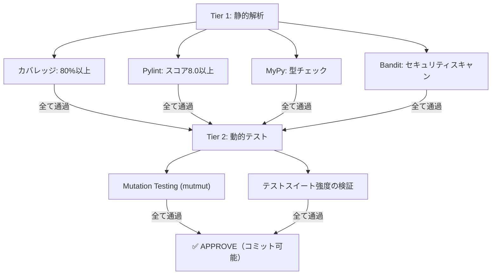
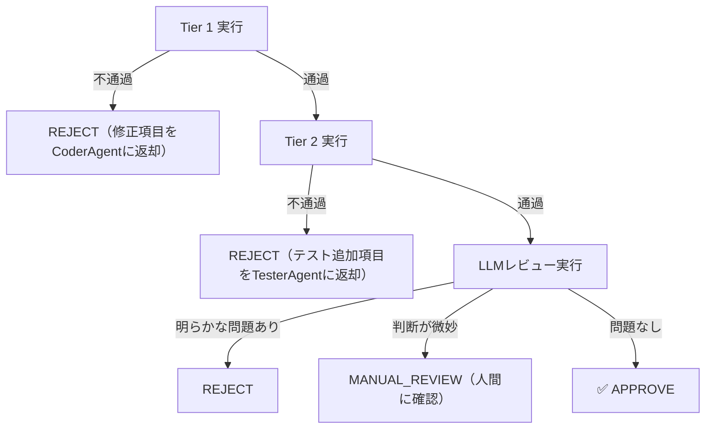

## はじめに

AIが生成したコードの品質をどう担保するか。単一のテストやレビューでは不十分です。静的解析、動的テスト、Mutation Testingの3層を組み合わせることで、多角的な品質保証が可能になります。

本記事では、AIエージェントのパイプラインに組み込んだ2層品質ゲートの設計と実装を紹介します。

## 2層品質ゲートの全体像



Tier 1は高速に実行でき、Tier 2は時間がかかるが深い品質保証を提供します。

## Tier 1: 静的解析

### カバレッジチェック

pytest-covを使用して、テストカバレッジが80%以上であることを確認します。

```bash
pytest --cov=src/nexuscore --cov-report=term-missing --cov-fail-under=80
```

カバレッジが基準を下回る場合、未カバーの行がレポートされ、CoderAgentが追加テストの生成に参照できます。

### Pylint

コード品質スコアが8.0以上であることを確認します。

```bash
pylint src/nexuscore --fail-under=8.0
```

### MyPy型チェック

型ヒントの整合性を検証します。

```bash
mypy src/nexuscore --strict
```

### Banditセキュリティスキャン

OWASP Top 10等の一般的なセキュリティ脆弱性を検出します。

```bash
bandit -r src/nexuscore -ll
```

### Tier 1の実行

全ツールを一括で実行し、結果を集約します。

```python
def run_tier1(source_dir: str) -> Tier1Result:
    results = {}
    results["coverage"] = run_coverage_check(source_dir)
    results["pylint"] = run_pylint(source_dir)
    results["mypy"] = run_mypy(source_dir)
    results["bandit"] = run_bandit(source_dir)

    all_passed = all(r.passed for r in results.values())
    return Tier1Result(
        passed=all_passed,
        details=results,
        summary=format_summary(results)
    )
```

## Tier 2: 動的テスト（Mutation Testing）

### なぜMutation Testingが必要か

Tier 1のカバレッジは「テストがコードを実行したか」を示すだけで、「テストが正しく検証しているか」は分かりません。

```python
# カバレッジ100%だが、実質的に何もテストしていない例
def test_process():
    result = process(data)  # 実行した（カバレッジに貢献）
    # アサーションがない → バグがあっても検出できない
```

Mutation Testingは、コードに意図的なバグを仕込み、テストがそれを検出できるかで品質を測ります。

### Tier 2の実行

```python
def run_tier2(source_dir: str, tests_dir: str) -> Tier2Result:
    mutation_result = run_mutation_testing(
        source_dir=source_dir,
        tests_dir=tests_dir,
        min_score=60.0  # 最低60%のKilled率
    )

    return Tier2Result(
        passed=mutation_result.score >= mutation_result.min_score,
        total_mutants=mutation_result.total,
        killed=mutation_result.killed,
        survived=mutation_result.survived,
        score=mutation_result.score
    )
```

## 品質ゲートとレビューの統合

GuardianAgentは、品質ゲートの結果をレビュー判断に統合します。

### 3つの判断状態

```python
class ReviewDecision:
    APPROVE = "approve"       # 品質ゲート通過 + レビューOK
    REJECT = "reject"         # 品質ゲート不通過 or レビューNG
    MANUAL_REVIEW = "manual"  # 品質ゲート通過だがレビューで懸念あり
```

### 判断フロー



### レビュー結果のフォーマット

```
品質ゲート結果
━━━━━━━━━━━━━━━━━━━━
Tier 1（静的解析）:
  カバレッジ: 85% (✅)
  Pylint: 8.5/10 (✅)
  MyPy: ✅ 通過
  Bandit: ✅ 通過

Tier 2（Mutation Testing）:
  Killed率: 59.9% (✅)
  325/543 mutants killed

レビュー: APPROVE
━━━━━━━━━━━━━━━━━━━━
```

## 差分レビュー（Diff Review）

全ファイルのレビューではなく、変更差分のみをレビューする高速モードもあります。

```python
def review_diff(self, diff_text: str) -> ReviewResult:
    # 差分の要約を生成
    summary = self.summarize_diff(diff_text)

    # 変更ファイルに対してのみ品質ゲートを実行
    changed_files = extract_changed_files(diff_text)
    tier1 = run_tier1(changed_files)

    # LLMレビューは差分のみに集中
    review = self.execute_llm_task(
        prompt=f"以下の差分をレビュー:\n{summary}",
        system_prompt=GUARDIAN_REVIEW_PROMPT
    )

    return ReviewResult(decision=review.decision, feedback=review.feedback)
```

差分レビューにより、大規模プロジェクトでもレビュー時間を短縮できます。

## 実運用での工夫

### 段階的な品質基準の導入

最初から全ツールを導入すると、既存コードの修正が大量に発生します。段階的な導入が推奨されます。

```
Week 1: カバレッジチェックのみ（60%スタート → 週5%引き上げ）
Week 2: Pylint追加（6.0スタート → 週0.5引き上げ）
Week 3: MyPy追加（警告レベル → エラーレベル）
Week 4: Bandit追加
Week 5: Mutation Testing追加（50%スタート）
```

### 意味のないアサーションの検出

GuardianAgentは、テストコード内の「意味のないアサーション」を検出します。

```python
# 検出パターン
assert True  # 常にTrue
assert result is not None  # Noneチェックだけで値の検証がない
assert len(errors) >= 0  # 常にTrue
```

これらはカバレッジには貢献しますが、品質保証には寄与しません。

### 危険な文字列パターンの検出

テストコード内に含まれる可能性のある危険なコマンド文字列を検出します。シェル呼び出しやSQL文の直接埋め込み等を静的にスキャンし、レビュー対象としてフラグ付けします。

## この設計の限界

- **Tier 2の実行時間**: Mutation Testingは数十分かかるため、全コミットで実行するのは非現実的。PR時やマージ前のみの実行が現実的
- **基準値のチューニング**: カバレッジ80%やPylint 8.0の閾値は、プロジェクトの成熟度に応じて調整が必要
- **AI生成コード特有の問題**: AIは品質ゲートの基準を「学習」して、形式的には通るが実質的に品質の低いコードを生成することがある

## おわりに

品質ゲートは多層にするほど強力ですが、同時に運用コストも増大します。Tier 1（静的解析）を高速な第一防衛ラインとし、Tier 2（Mutation Testing）を深い品質保証の第二防衛ラインとする2層構成は、コストと品質のバランスが良い構成です。

品質保証は「一度導入して終わり」ではなく、プロジェクトの成長に合わせて基準を引き上げていく継続的な取り組みです。

### 関連記事

- [Mutation Testingでテスト品質を測る](https://zenn.dev/fukukei23/articles/mutation-testing-mutmut-practice)
- [AIエージェントの自己修復ループ設計](https://zenn.dev/fukukei23/articles/ai-agent-self-healing-loop)
- [14のAIエージェントを協調させるマルチエージェントアーキテクチャの設計](https://zenn.dev/fukukei23/articles/multi-agent-orchestration-design)
