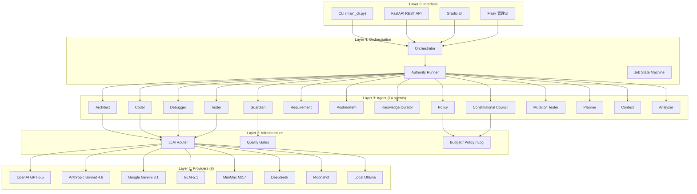
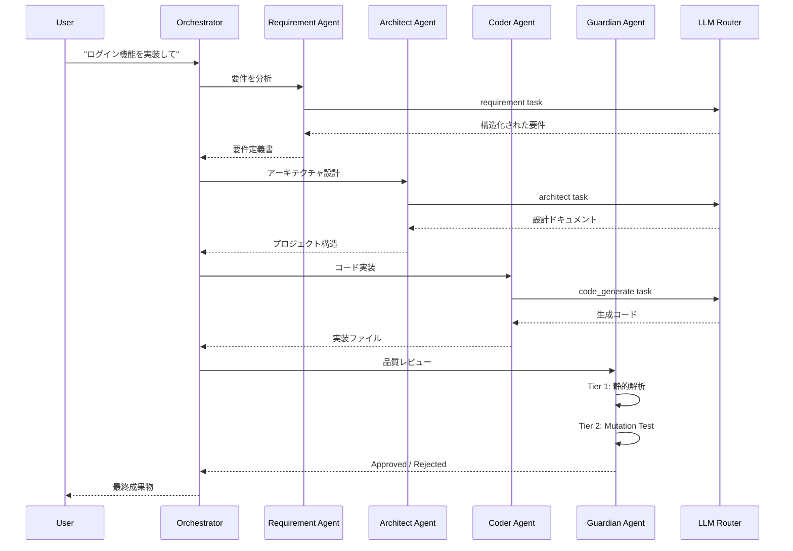
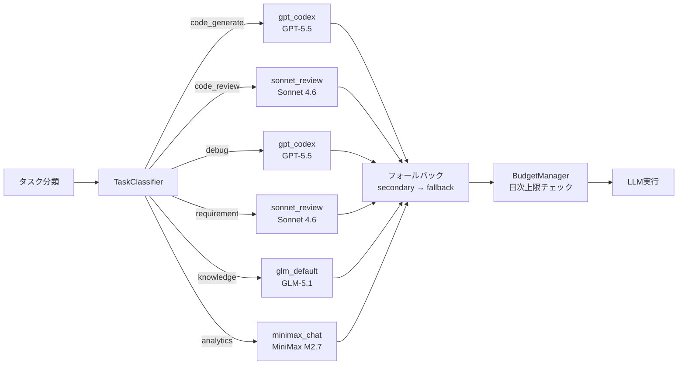
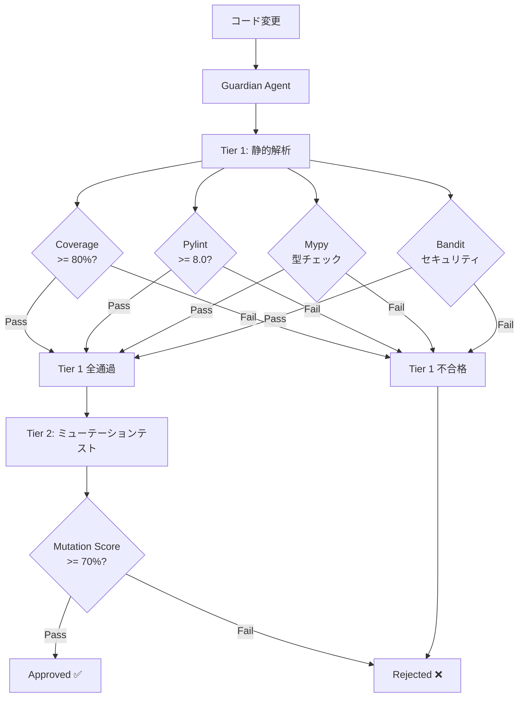
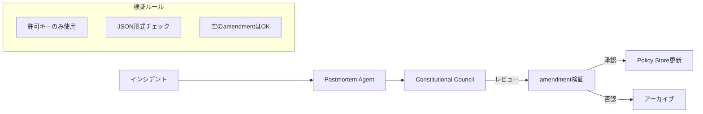

## 0. なぜ「AIエージェント群」なのか

「ChatGPTにコードを書かせる」だけでは、プロダクション品質のコードは生まれません。

レビュー、テスト、セキュリティ検査、要件の明確化——人間の開発者が当たり前にやっていることをAI開発でも実現するには、**専門化されたエージェントの協調**が必要です。

[NexusCore](https://github.com/fukukei23/NexusCore)は、14の専門エージェントがソフトウェア開発ライフサイクル全体を自律実行するオープンソースフレームワークです。

- 235のPythonモジュール、4624のテストケース
- 8つのLLMプロバイダーを統合するタスクベースルーター
- 2段階の品質ゲート（静的解析 + ミューテーションテスト）
- Constitutional AIによるガバナンス自動化

この記事では、NexusCoreの**アーキテクチャ設計**と**実装上の工夫**を解説します。

## 1. システム全体アーキテクチャ

NexusCoreは5つのレイヤーで構成されています。



### レイヤーの責務

| レイヤー | 役割 | 代表モジュール |
|---|---|---|
| Interface | ユーザーとの接点 | `api/`, `webapp/`, `ui/` |
| Orchestration | エージェントの調停・状態管理 | `orchestrator/`, `core/` |
| Agent | 専門領域の自律実行 | `agents/` (14モジュール) |
| Infrastructure | LLM・品質・ガバナンス基盤 | `llm/`, `guard/`, `npe/` |
| Provider | 各LLM APIの呼び出し | `llm/providers/` (8種) |

**ポイント**: 各レイヤーは上位レイヤーにのみ依存し、下位レイヤーの実装詳細を知りません。これにより、LLMプロバイダーの追加・差し替えが上位レイヤーに影響しません。

## 2. マルチエージェント協調の仕組み

### Orchestratorによるフェーズ管理

NexusCoreの開発フローは、Orchestratorが**フェーズ単位**でエージェントを起動します。



### Authority Runner — 権限レベルによる実行制御

エージェントの自律度を3段階で制御します：

| レベル | 名前 | 動作 | 用途 |
|---|---|---|---|
| 0 | `HUMAN_CONTROLLED` | 各フェーズで人間の承認必須 | 本番環境 |
| 1 | `PARTIALLY_AUTONOMOUS` | 低リスク変更は自動、高リスクは承認 | ステージング |
| 2 | `FULLY_AUTONOMOUS` | 全フェーズ自動実行 | 開発環境 |

```python
# orchestrator/authority_runner.py のコアロジック
def run_with_authority(orchestrator, user_requirement, authority_level, language):
    if authority_level == "HUMAN_CONTROLLED":
        # 各フェーズ完了時にユーザー確認
        return _run_with_gates(orchestrator, user_requirement, gate_every=True)
    elif authority_level == "FULLY_AUTONOMOUS":
        # 品質ゲート通過のみで自動進行
        return _run_with_gates(orchestrator, user_requirement, gate_every=False)
```

### BaseAgent — 全エージェントの統一IF

14のエージェントはすべて`BaseAgent`を継承し、共通のLLM呼び出しIFを持ちます：

```python
class BaseAgent:
    SYSTEM_PROMPT: str = "You are a helpful assistant."

    def execute_llm_task(self, prompt, as_json=False):
        """全エージェント共通のLLM呼び出しエントリポイント"""
        # 1. llm_router経由で最適なモデルを選択
        # 2. リトライ（レート制限・タイムアウト対応）
        # 3. as_json=True時はJSON-only system指示を自動付与
        # 4. フォールバック（ルーター不使用時の直接呼び出し）
```

これにより、新しいエージェントの追加は**クラス継承 + system_prompt定義**だけで済みます：

```python
class ArchitectAgent(BaseAgent):
    SYSTEM_PROMPT = "You are a senior software architect..."

    def design_architecture(self, requirement):
        return self.execute_llm_task(
            f"Design the project structure for: {requirement}",
            as_json=True
        )
```

## 3. LLMルーティング設計

### タスクベースのモデル選択

「コード生成にはGPT-5.5」「レビューにはSonnet」「分析にはGLM」——タスクに応じて最適なモデルを自動選択します。



### プロファイルレジストリ

9つのプロファイルが用途別に定義されています：

```python
PROFILE_REGISTRY = {
    # 品質ティア（コード・推論・設計）
    "gpt_codex":    LLMProfile(provider="openai",    model="gpt-5.5"),
    "sonnet_review": LLMProfile(provider="anthropic", model="claude-sonnet-4-6"),
    "sonnet_code":  LLMProfile(provider="anthropic", model="claude-sonnet-4-6"),
    "gemini_secondary": LLMProfile(provider="google", model="gemini-3.1-pro"),

    # 軽量ティア（チャット・分類・分析）
    "glm_default":  LLMProfile(provider="glm",    model="glm-5.1"),
    "glm_strict":   LLMProfile(provider="glm",    model="glm-5.1"),
    "minimax_chat": LLMProfile(provider="minimax", model="minimax-m2.7"),
}
```

### 3段フォールバック

各タスクにはprimary → secondary → fallbackの3段階が設定されています：

```python
TASK_MODEL_CONFIGS = {
    "code_generate": TaskModelConfig(
        primary="gpt_codex",           # 1st: GPT-5.5
        secondary=["sonnet_code", "glm_default"],  # 2nd: Sonnet → GLM
        fallback="glm_default",         # 最終: GLM-5.1
    ),
    "code_review": TaskModelConfig(
        primary="sonnet_review",        # 1st: Sonnet 4.6
        secondary=["gpt_strict", "glm_strict"],
        fallback="glm_strict",
    ),
}
```

APIキー未設定・レート制限・タイムアウト等のエラー時に、自動的に次の候補にフォールバックします。これにより**「APIキーが1つもない」場合以外はシステム全体が停止しない**設計になっています。

### 予算管理

日次のLLM利用料を上限管理します：

```python
class BudgetManager:
    def check_budget(self, estimated_cost_usd):
        if self.daily_spent + estimated_cost_usd > self.daily_limit:
            # 高品質ティアから軽量ティアへ自動ダウングレード
            return self._downgrade_model()
        return True
```

## 4. 多層品質ゲート

Guardian Agentが2段階の品質検証を実行します。Tier 1を通過しないとTier 2に進めません。



### Tier 1: 静的解析（4種並列）

| ツール | 閾値 | 検出内容 |
|---|---|---|
| pytest-cov | 80% | テストカバレッジ不足 |
| Pylint | 8.0/10 | コード品質スコア |
| Mypy | エラーゼロ | 型アノテーション不整合 |
| Bandit | 高リスクゼロ | セキュリティ脆弱性 |

### Tier 2: ミューテーションテスト

「テストが通っている」だけでは不十分です。テストが**本当にバグを検出できるか**を検証します。

```python
@dataclass
class MutationReport:
    passed: bool
    mutation_score: float    # キル率（70%以上が合格）
    total_mutants: int       # 生成された変異体数
    killed: int              # テストが検出した変異体
    survived: int            # テストが見逃した変異体
    survived_mutants: list   # 見逃しの詳細（修正のヒントになる）
```

MutationTester Agentがコードの一部を意図的に破壊し、テストがそれを検出できるかを確認します。`survived`（生き残った変異体）が多いテストは「テストの質が低い」と判定されます。

## 5. 実装の工夫と知見

### 5-1. God Class分割の教訓

NexusCoreの開発過程で、最大の技術的負債は**God Class**（何でもやる巨大クラス）でした。

| ファイル | 分割前 | 分割後 | アプローチ |
|---|---|---|---|
| `llm_router.py` | 789行 | 280 + 2ファイル | RoutedLLM・utils分離 |
| `guardian_auto_reviewer.py` | 412行 | 151 + 309行 | チェッカー関数抽出 |
| `self_healing_service.py` | 423行 | 240 + 3ファイル | God Method解体 |
| `constitutional_council_agent.py` | 607行 | 338 + 2ファイル | ポリシー操作分離 |

**分割のポイント**:

1. **後方互換デリゲート** — 抽出先のモジュールレベル関数を、元クラスの薄いメソッドが呼び出す。既存のテストが壊れない。

```python
# guardian_auto_reviewer.py (分割後)
class GuardianAutoReviewer:
    def _check_sandbox_violations(self, diff, rules):
        """後方互換デリゲート"""
        from .checkers import check_sandbox_violations
        return check_sandbox_violations(diff, rules)
```

2. **循環import回避** — 分割先のモジュールが元モジュールをimportする場合、re-exportではなく**呼び出し側のimportパスを更新**する。

3. **テストの書き直し不要** — デリゲートパターンにより、既存テストは元クラスのメソッドを呼び続ける。

### 5-2. Constitutional AI — ガバナンスの自動化

NexusCoreは「AIが勝手にルールを変える」ことを防ぐため、**憲法的ガバナンス**を採用しています。



- **Postmortem Agent** が失敗を分析し、改善案をamendment（修正案）として提案
- **Constitutional Council** がamendmentを検証（許可されたキーのみ、正しい形式）
- 承認されたamendmentのみPolicy Storeに反映

### 5-3. テスト戦略

4624のテストケースを安定して維持するための工夫：

```python
# 1. 外部依存のモック化（CI-safe）
@patch("subprocess.run")
def test_run_tests_via_subprocess(mock_run):
    mock_run.return_value = MagicMock(returncode=0, stdout="2 passed")
    success, output = run_tests(Path("/fake/repo"))
    assert success is True

# 2. インポート失敗時のskip（オプショナル依存）
try:
    from nexuscore.utils.test_generator import generate_tests
    HAS_TEST_GENERATOR = True
except ImportError:
    HAS_TEST_GENERATOR = False

@pytest.mark.skipif(not HAS_TEST_GENERATOR, reason="not available")
def test_generate():

# 3. フレークテストの管理
@pytest.mark.xfail(reason="Flaky in full suite - passes in isolation")
```

**結果**: 4624 passed / 5 failed（0.11%、全件非再現性フレーク）

## 6. まとめ

NexusCoreの設計思想は3つに集約されます：

1. **専門化と協調** — 単一の万能AIではなく、専門エージェントの協調による高品質な成果物
2. **階層化とフォールバック** — LLMルーターの3段フォールバック、品質ゲートの2段階検証
3. **自律と統制のバランス** — Authority Runnerによる権限制御、Constitutional Councilによるガバナンス

コードはすべて [GitHub](https://github.com/fukukei23/NexusCore) で公開しています（Apache 2.0）。マルチエージェントシステムの設計に興味がある方の参考になれば幸いです。

---

**プロジェクト情報**:
- GitHub: https://github.com/fukukei23/NexusCore
- テストカバレッジ: 85%+
- Python 3.12+ / FastAPI / Flask / 8 LLM providers
