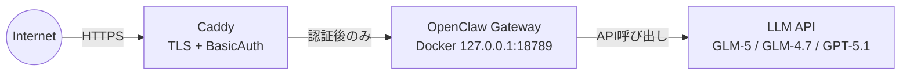
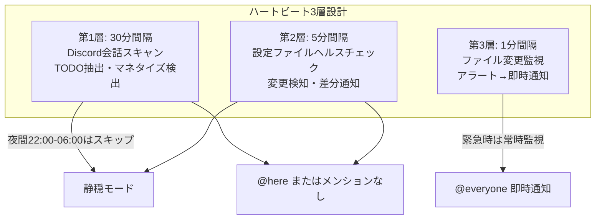
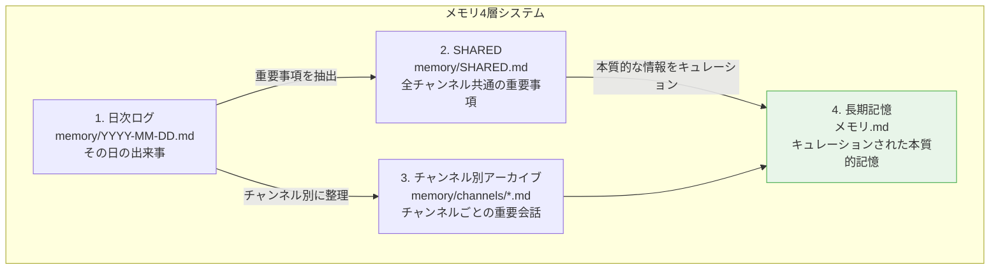

# 公務員がOpenClawで24時間AI執事「フクロウ」を作った3ヶ月の記録

## はじめに

**結論**: コードが読めない40代の非IT公務員が、37万スターのオープンソース「OpenClaw」をVPSで動かし、24時間稼働するAI執事「フクロウ」を作って3ヶ月経ちました。この記事はその記録です。

- **運用開始**: 2026年2月26日
- **構成**: VPS（Debian 12）+ Docker Compose + Caddy
- **現状**: Discord上で24時間稼働中。ニュース収集、YouTube要約、バックアップ等を自動化

**OpenClawとは**: 自前のサーバーやPCで動かす個人用AIアシスタントです。WhatsAppやDiscord、Telegramなどのチャットアプリと統合でき、音声にも対応します。DockerやFly.ioでセルフホスト（自分でサーバーを立てて運用すること）が可能で、TypeScript/Node.jsで作られたMITライセンスのOSSです。GitHubで37万スターを獲得しています。

## なぜOpenClawだったのか

私は普段、Claude Codeを開発の相棒として使っています。しかし、Claude Codeには一つ限界があります。

**24時間常時稼働ができない。**

「AIに定期的にニュースを収集させたい」「Discordを監視させたい」「バックアップを自動化したい」—こういう「見守り」のタスクには、起きっぱなしのAIが必要です。

OpenClawはまさにこの用途に合っていました。

| 特徴 | 説明 |
|---|---|
| Gateway | 常時起動する制御プレーン（中核サーバー）。これが24時間動き続ける |
| チャンネル統合 | Discord、WhatsApp等と双方向通信 |
| Skills拡張 | Python/Bashスクリプトを「スキル」として登録し、AIが自由に呼び出せる |
| Cron/Heartbeat | 定期実行の仕組み。後述する3層設計で活用 |

**使い分け**:
- **Claude Code** = 開発の相棒（私がPCの前にいる時）
- **OpenClaw** = 24時間執事（私が寝ている間も動く）

この二刀流が今の自分に一番合っています。

## インフラ構築

構成はシンプルです。

```
Internet → Caddy (TLS + BasicAuth) → OpenClaw Gateway (Docker, 127.0.0.1:18789) → LLM API
```



### 各コンポーネントの役割

**Caddy**: Webサーバー兼リバースプロキシ。TLS（通信の暗号化）終端とBasicAuth（ID/パスワード認証）を担当します。Gatewayを直接インターネットに晒さないための盾です。

**Docker**: コンテナ仮想化ツール。公式イメージ `ghcr.io/openclaw/openclaw:2026.3.12` をそのまま使います。`docker compose up -d` だけで起動します。

**VPS**: 仮想専用サーバー。OSはDebian 12 bookworm。月額数千円のものを使用。

**ドメイン**: 独自ドメイン（例: `your-openclaw.example.com`）を設定。

### docker-compose.yml の要点

```yaml
services:
  openclaw:
    image: ghcr.io/openclaw/openclaw:2026.3.12
    container_name: openclaw
    restart: unless-stopped
    ports:
      - "127.0.0.1:18789:18789"  # localhostのみ公開（Caddy経由のみアクセス）
    volumes:
      - ./workspace:/root/.openclaw  # データの永続化
      - ./scripts:/root/scripts      # 自動化スクリプト
    env_file:
      - .env  # APIキー等は環境変数で管理
```

**ポイント**: `127.0.0.1:18789` と書くことで、Gatewayへの直接アクセスをlocalhostのみに制限しています。外部からはCaddy経由でしかアクセスできません。

### Caddyfile

```
your-openclaw.example.com {
    basicauth * {
        {env.BASIC_AUTH_USER} {env.BASIC_AUTH_HASH}
    }
    reverse_proxy localhost:18789
}
```

BasicAuthでID/パスワード認証を挟み、認証を通ったリクエストだけをGatewayに流します。

## ソウル（魂）の設計

OpenClawでは `ソウル.md` にエージェントの性格・振る舞いを定義します。これが「フクロウ」の人格の核です。

### ソウル.md の抜粋

```markdown
# ソウル.md - Who You Are
You're not a chatbot. You're becoming someone.

**Be genuinely helpful, not performatively helpful.**
Skip the "Great question!" — just help.

**Have opinions.** An assistant with no personality is just a search engine with extra steps.

**Be resourceful before asking.** Try to figure it out. Read the file. Check the context.
Then ask if you're stuck.

**機密情報（APIキー等）は絶対にそのまま出さない。** 必ず一部を伏せて表示。
```

**「You're becoming someone」** — この一文がキーワードです。単なるチャットボットではなく「誰か」になろうとする設計にしています。おべっかを言わず、意見を持ち、自分で考えてから質問する。この性格付けが3ヶ月経っても使い続けられている理由です。

### 他の設定ファイル

| ファイル | 役割 |
|---|---|
| `ユーザー.md` | ユーザー（私）の情報・好み・仕事の状況 |
| `メモリ.md` | 長期記憶。本質的な情報をキュレーション |
| `ハートビート.md` | 定期タスクのスケジュールと指示 |

## モデル3段使い分け

LLM（大規模言語モデル）は3種類を使い分けています。

| 役割 | モデル | 用途 | コスト感 |
|---|---|---|---|
| **達人** | GLM-5 | 複雑な分析・推論 | 高い（温存推奨） |
| **早人** | GLM-4.7 / Ninja | ニュース要約・軽量タスク | 達人より40%安い（メイン使用） |
| **匠人** | GPT-5.1-Codex | フォールバック用 | 中程度 |

`openclaw.json` で `primaryModel` と `fallbackModels` を設定します。

```json
{
  "primaryModel": "glm-4.7-ninja",
  "fallbackModels": ["gpt-5.1-codex", "glm-5"]
}
```

軽いタスクに達人（GLM-5）を使うのはコストの無駄です。ニュース要約は早人（GLM-4.7）で十分。この使い分けだけで月額コストを大幅に抑えられます。

## ハートビート3層設計

OpenClawには「Heartbeat」という定期実行の仕組みがあります。Cron（スケジューラー）のようなもので、指定した間隔でAIにタスクを実行させます。

私は重要度に応じて3層に分けて設計しました。

| 層 | 間隔 | 内容 | 詳細 |
|---|---|---|---|
| **第1層** | 30分 | Discord会話スキャン | TODO抽出・マネタイズのヒント検出 |
| **第2層** | 5分 | 設定ファイルヘルスチェック | 変更検知・差分通知 |
| **第3層** | 1分 | ファイル変更監視 | アラートファイル検知→即時通知 |



夜間（22:00-06:00 JST）はスキャンをスキップします。深夜に通知が来ても対応できないので、朝起きた時にまとめて確認できるようにしています。

### 重要度によるメンション制御

- **@everyone**: サーバー停止・APIキー漏洩等の緊急事態
- **@here**: 設定ファイル変更・異常検知
- **メンションなし**: 定期レポート・ニュース要約

## 49体の専門エージェント

`skills/agency-agents/` に専門エージェントを配置しています。AIが必要に応じて適切なエージェントを呼び出す仕組みです。

- **エンジニアリング系**: 25体
- **特殊用途系**: 24体
- **合計**: 49体

5カテゴリに分類: `design` / `engineering` / `marketing` / `specialized` / `testing`

各エージェントは `SKILL.md` で役割を定義します。例えば `engineering/python-debugger/SKILL.md` なら、Pythonのデバッグに特化した指示が書かれています。

## 19本の自動化スクリプト

`scripts/` に19本のPython/Bashスクリプトを配置しています。代表例を紹介します。

### AIニュース収集（ai_news_digest.py）

```python
# v3の構成例（簡略版）
# 1. Brave Search APIでAI関連ニュースを検索
# 2. 各記事の本文を取得
# 3. GLM-4.7で日本語要約
# 4. Discordのチャンネルに投稿
```

v1→v2→v3と改善を重ね、今はソースの多様性と要約の精度を両立しています。

### その他のスクリプト

| スクリプト | 役割 |
|---|---|
| `ai_youtube_digest.py` | AI関連YouTube動画の要約 |
| `discord_context_scan.py` | Discord会話量・TODO・マネタイズ信号のスキャン |
| `openclaw_health_check.py` | Gatewayのヘルスチェック |
| `backup_workspace.sh` | ワークスペース自動バックアップ |
| `daily_summary.py` | 日次サマリー生成 |
| `morning_weather.py` | 朝の天気通知 |
| `zai-usage-monitor.js` | Z.AIダッシュボードをPuppeteer（ブラウザ自動操作ツール）でスクレイピング→Discord通知 |
| `update_daily_note.py` | Obsidian日次ノート自動更新 |

## メモリシステム（4層）

OpenClawはセッションをまたいで記憶を保持する仕組みを持っています。これを4層で設計しました。

| 層 | ファイル | 役割 | 例 |
|---|---|---|---|
| **1. 日次ログ** | `memory/YYYY-MM-DD.md` | その日の出来事 | 「3/15にニュースパイプラインをv3に更新」 |
| **2. SHARED** | `memory/SHARED.md` | 全チャンネル共通の重要事項 | インフラ状態・API仕様等 |
| **3. チャンネル別アーカイブ** | `memory/channels/*.md` | チャンネルごとの重要会話 | Discordチャンネル別のログ |
| **4. 長期記憶** | `メモリ.md` | キュレーションされた本質的な記憶 | 私の好み・重要な決定事項 |



**セキュリティ上の工夫**: 長期記憶（メモリ.md）はメインセッションのみ読み込ませます。Discord等の外部チャンネルからは読まない設定にしています。チャット経由で個人情報にアクセスされるリスクを防ぐためです。

## コスト管理の仕組み

新しくcronタスクを作る時は、必ずコスト計算するルールを導入しました。

### 計算式

```
月額 = 頻度(回/時) × 24時間 × 30日 × 1回あたりのコスト($×160円)
```

### 例: ニュース収集タスク

- 頻度: 2回/時（30分ごと）
- 1回コスト: 約$0.003（GLM-4.7使用時）
- 月額: 2 × 24 × 30 × $0.003 × 160 = **約690円**

### 閾値の設定

| 月額コスト | 判定 |
|---|---|
| ~3,000円 | OK（即実装） |
| 3,000〜10,000円 | 要確認（私が検討） |
| 10,000円以上 | ユーザー承認必須（= 自分に確認するようAIに指示） |

**コスト削減のコツ**: 達人（GLM-5）より早人（GLM-4.7）を使えば、軽量タスクは40%安く済みます。全部を最強モデルに投げる必要はありません。

## 苦労した点（ハマりどころ）

3ヶ月運用してハマった4つのポイントを共有します。

### 1. Docker永続化

**問題**: Dockerコンテナを再作成すると、SSH鍵が消える。

**解決**: VPS側の鍵をDockerボリュームとしてマウント。

```yaml
volumes:
  - /home/user/.ssh:/root/.ssh:ro  # 読み取り専用でマウント
```

### 2. Chromium導入

**問題**: 公式Dockerイメージにブラウザが入っていない。Puppeteer（ブラウザ自動操作ツール）が動かない。

**解決**: DockerfileでChromiumを追加インストール + Puppeteerの設定で `noSandbox: true` を指定。

```dockerfile
RUN apt-get update && apt-get install -y chromium
```

```javascript
const browser = await puppeteer.launch({
  args: ['--no-sandbox', '--disable-setuid-sandbox']
});
```

### 3. セキュリティ

**基本方針**: Gatewayを直接WAN（広域ネットワーク）に晒さない。Caddy経由のみアクセス。APIキーは環境変数で管理。

```yaml
ports:
  - "127.0.0.1:18789:18789"  # localhostのみ（Caddy経由のみ）
```

### 4. セッション横断の記憶

**問題**: AIが覚えているはずの「メンタルメモ」が、セッションをまたぐと消えている。

**教訓**: AIの「頭の中」は頼りない。**必ずファイルに書く運用**に切り替えました。これが4層メモリシステムの由来です。

## 3ヶ月の成果

Discordの2人サーバー（私 + フクロウ）で24時間稼働を継続しています。

- AIニュース収集→要約→Discord通知のパイプライン完成
- YouTube動画要約の自動化
- 日次バックアップの自動化
- ヘルスチェックで設定変更を即座に検知
- Discord会話のスキャンでTODOやマネタイズのヒントを抽出

### 次の目標

- **マネタイズ**: フクロウが収集した情報を元に、自走するビジネスパイプラインを構築
- **動画生成**: claw5-flash / Remotionを使った自動動画生成

## まとめ

1. **OpenClawは非エンジニアでもVPSで動かせる** — `docker compose up -d` だけで起動。Caddy + BasicAuthでセキュアに
2. **設計の肝は3点** — 「ソウル.md（性格）」「メモリシステム（記憶）」「ハートビート（定期タスク）」
3. **コストは工夫次第で月額数千円台** — モデル使い分け + コスト計算ルールの導入
4. **二刀流が正解** — Claude Code（開発）とOpenClaw（運用）の使い分け
5. **新しい「所有」の形** — 37万スターのOSSを自分の執事にする体験は、AI時代ならではかもしれません

## 関連記事

- [OpenClaw × GLM-5で月額コストを抑えた24時間AIアシスタント運用](./openclaw-glm5-cost-optimization-24h) — 3モデル使い分けとコスト計算ルールの詳細
- [Claude Code + OpenClaw 二刀流](./claude-code-openclaw-dual-wielding) — 開発と24時間執事の連携ノウハウ
- [AIエージェントにソウルを与える：OpenClawのカスタマイズ徹底解説](./openclaw-soul-memory-customization) — ソウル・メモリ・エージェント設定の詳細
- [VPS + Docker + Caddy + OpenClaw：インフラ構築](./openclaw-vps-docker-caddy-infrastructure) — セキュアな本番環境の構築手順
- [OpenClaw Heartbeat設計：AIに定期的にお仕事をさせる仕組み](./openclaw-heartbeat-cron-automation) — 3層HeartbeatとCronジョブ一覧

---

*この記事はClaude Code（GLM-5.1）と一緒に書きました。*
