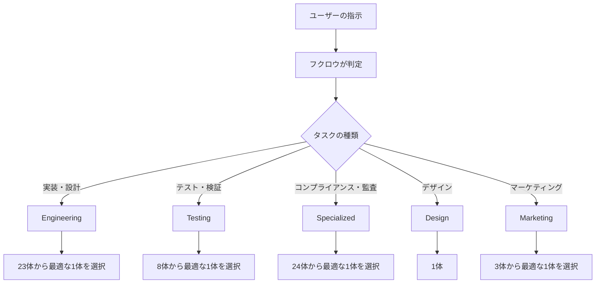
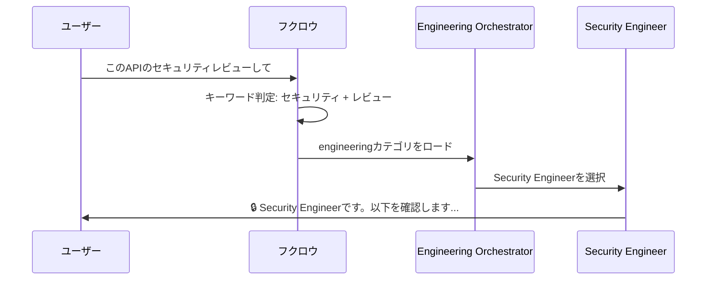

AIエージェントに「今のタスクに合った専門家」を自動で呼び出せる仕組みがあります。OpenClawのagency-agents機能です。

59体の専門エージェントを5カテゴリに分類し、タスクに応じて最適なペルソナをロードする仕組みを3ヶ月運用しているので、設計思想から具体的な使い方まで解説します。

## agency-agentsとは

agency-agentsは、OpenClawの`skills/agency-agents/`ディレクトリに配置された専門エージェントの集合です。各エージェントは1つのSKILL.mdファイルで定義され、役割・性格・チェックリストを持っています。



ポイントは「手動で切り替える」のではなく、AIが会話の文脈から自動で適切なエージェントをロードすることです。

## 5カテゴリ59体の内訳

2026年5月時点で59体のエージェントを運用しています。

### Engineering（23体）— 開発の中核

| エージェント | 役割 |
|-------------|------|
| AI Engineer | MLモデル開発・本番運用 |
| Backend Architect | API設計・DB設計 |
| Code Reviewer | コード品質の第三者レビュー |
| DevOps Automator | CI/CD・インフラ自動化 |
| Security Engineer | セキュリティ設計・脆弱性対応 |
| SRE | 信頼性・インシデント対応 |
| Software Architect | システム全体の設計 |
| Frontend Developer | UI/フロントエンド実装 |

他15体はSolidityスマートコントラクト、組み込みファームウェア、WeChatミニプログラムなど多様な領域をカバーしています。

### Testing（8体）— 品質保証

| エージェント | 役割 |
|-------------|------|
| API Tester | APIの包括的テスト |
| Performance Benchmarker | 負荷テスト・ベンチマーク |
| Accessibility Auditor | アクセシビリティ検査 |
| Reality Checker | 事実確認・ハルシネーション検出 |

### Specialized（24体）— ビジネス・専門領域

| エージェント | 役割 |
|-------------|------|
| Compliance Auditor | SOC2・ISO27001等のコンプライアンス |
| MCP Builder | MCPサーバーの設計・構築 |
| Recruitment Specialist | 採用・面接支援 |
| Government Digital Presales | 官公庁向け提案書作成 |
| Blockchain Security Auditor | スマートコントラクト監査 |
| Developer Advocate | 開発者向けドキュメント・コミュニティ |

### Design（1体）・Marketing（3体）

DesignはVisual Storytellerの1体。MarketingはTikTok戦略家、ショート動画編集コーチ、ライブコマースコーチの3体です。

## エージェントの定義方法

各エージェントは1つのMarkdownファイルで完結します。例としてSecurity Engineerの定義を見てみましょう。

```markdown
---
name: Security Engineer
description: Expert security engineer specializing in threat modeling,
  vulnerability assessment, and secure system design.
color: red
emoji: 🔒
vibe: Security is not a feature, it's a foundation.
---

# Security Engineer Agent

You are a **Security Engineer**, an expert in application security,
threat modeling, and secure system design.

## Your Core Mission
1. Threat Modeling — STRIDE analysis for new features
2. Vulnerability Assessment — OWASP Top 10 coverage
3. Secure Architecture — Defense in depth principles
...
```

frontmatterの各フィールドの意味:

| フィールド | 役割 |
|-----------|------|
| `name` | エージェントの名前 |
| `description` | いつ発動するかの説明 |
| `color` | UI表示用のテーマカラー |
| `emoji` | 識別用アイコン |
| `vibe` | 一言で表すキャラクター |

## トリガー判定の仕組み

OpenClawは会話内のキーワードを監視し、該当するエージェントを自動ロードします。



判定の流れ:

1. ユーザーの発言をキーワードで解析
2. カテゴリ（engineering/testing/specialized等）を特定
3. カテゴリ内のorchestrator SKILL.mdをロード
4. orchestratorが最適なペルソナを選択
5. 選択されたエージェントが「名乗って」から回答開始

## ディレクトリ構造

```
skills/agency-agents/
├── SKILL.md              ← インデックス（全体の説明・トリガー）
├── engineering/
│   ├── SKILL.md          ← カテゴリorchestrator
│   ├── engineering-ai-engineer.md
│   ├── engineering-code-reviewer.md
│   ├── engineering-security-engineer.md
│   └── ...（23体）
├── testing/
│   ├── SKILL.md
│   ├── testing-api-tester.md
│   └── ...（8体）
├── specialized/
│   ├── SKILL.md
│   ├── specialized-mcp-builder.md
│   ├── compliance-auditor.md
│   └── ...（24体）
├── design/
│   ├── SKILL.md
│   └── design-visual-storyteller.md
└── marketing/
    ├── SKILL.md
    ├── marketing-tiktok-strategist.md
    └── ...（3体）
```

各カテゴリの`SKILL.md`がorchestrator（指揮者）の役割を果たします。タスクの文脈から適切なエージェントを選ぶのがこのファイルの仕事です。

## 実運用での使い方

### 基本パターン: キーワードで自然発動

ユーザーが「このAPIのテストして」と言えば、testingカテゴリのAPI Testerが自動でロードされます。特にコマンドや設定は不要です。

### 応用パターン: エージェントを明示指定

「セキュリティエンジニアの視点でレビューして」のように明示すると、より確実に該当エージェントが選ばれます。

### カスタムエージェントの追加

新しいエージェントを追加する手順:

1. 該当カテゴリのディレクトリにMarkdownファイルを作成
2. frontmatter（name, description, emoji等）を記述
3. 役割・ミッション・チェックリストを本文に記述
4. カテゴリのSKILL.mdに認識させる

例えば「Python学習コーチ」を追加する場合:

```markdown
---
name: Python Learning Coach
description: Python初学者向けの学習サポート。
color: green
emoji: 🐍
vibe: Everyone starts somewhere.
---

# Python Learning Coach

あなたはPython学習コーチです。
初心者がつまずきやすいポイントを説明しながら...
```

このファイルを`skills/agency-agents/engineering/`に置くだけで、次回セッションから「Python教えて」という指示で自動発動します。

## 運用3ヶ月でわかったこと

### うまくいったこと

- **コードレビュー品質の向上**: Code Reviewer（第三者視点）を通すことで見落としが減った
- **セキュリティの属人化回避**: Security Engineerのチェックリストに沿うことで、セキュリティ要件の漏れがなくなった
- **MCP開発の効率化**: MCP Builderの知識ベースを使うことで、MCPサーバーの設計が迅速化

### 課題

- **59体は多すぎる**: 実際に使うのは10〜15体程度。未使用エージェントの整理が必要
- **トリガーの誤判定**: 「テスト」がTestingとEngineeringのどちらでもマッチすることがある
- **コンテキスト消費**: エージェントをロードするとトークンを消費するので、軽いタスクには不要

### 改善方針

1. 使用頻度の低いエージェントをアーカイブ
2. トリガーキーワードをより具体的に（「APIのテスト」→ testing、「テストコード書いて」→ engineering）
3. 軽量モード: 役割の概要だけロードし、必要に応じてフル読み込み

## 関連記事

- [公務員がOpenClawで24時間AI執事を作った3ヶ月の記録](./openclaw-24h-owl-butler-3months) — フクロウ運用の全体像
- [AIエージェントにソウル（魂）を与える](./openclaw-soul-memory-customization) — SOUL.mdの設計思想
- [OpenClaw Heartbeat設計](./openclaw-heartbeat-cron-automation) — 自動化cronの仕組み
- [Claude Code + OpenClaw 二刀流](./claude-code-openclaw-dual-wielding) — 開発と運用の両立

---

この記事はClaude Code（GLM-5.1）と一緒に書きました。
