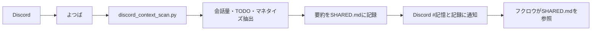
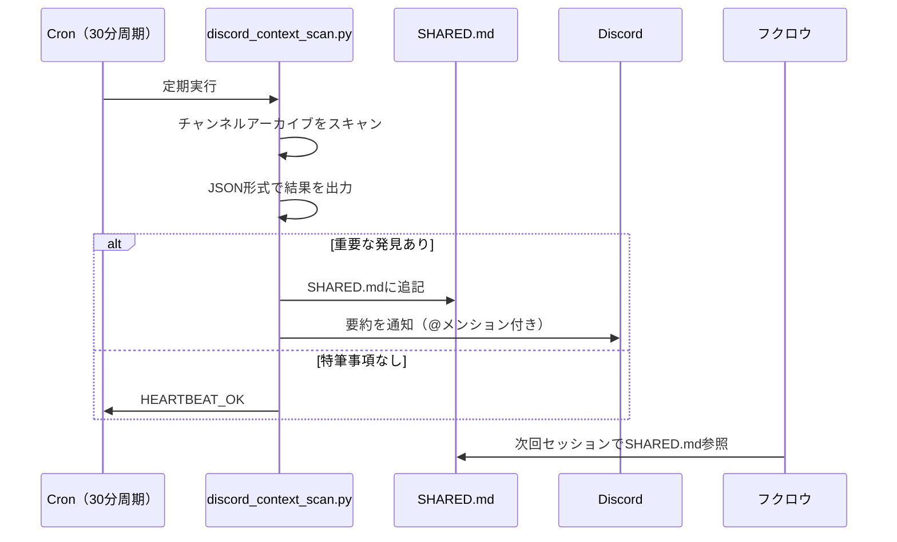

AIエージェントにDiscordのチャットを監視させ、重要な会話を見逃さない仕組みを作りました。OpenClawのyotsuba botとheartbeat cronを組み合わせた構成です。

3ヶ月運用して「会話の要約」「未対応TODOの自動抽出」「マネタイズのヒント発掘」まで自動化できたので、構成とコードを解説します。

## 2体のAIエージェント構成

OpenClawでは2体のAIエージェントを役割分担して運用しています。

| エージェント | 稼働環境 | 役割 |
|-------------|---------|------|
| フクロウ | VPS（24時間常時） | 本番運用・自動化・Heartbeat |
| よつば | ローカルPC（Surface Go） | 開発・実験・Discord監視 |

よつばはSurface Go上で動くセカンダリエージェントで、フクロウの補助としてDiscordチャットの監視を担当しています。



## よつばbotの設計

### SOUL.md — キャラクター定義

```yaml
名前: よつば（四葉）
由来: 四つ葉のクローバー
環境: Surface Go / Ubuntu 24.04
LLM: GLM-5（プライマリ）/ MiniMax-M2.7（フォールバック）
Discord: fopenclawサーバー（よつば#0087）
```

OpenClawでは各エージェントにSOUL.mdでキャラクターを定義します。よつばは「親しみやすく、簡潔に」が口調の基本です。

### AGENTS.md — 運用ルール

よつばの重要なルールは「フクロウのファイルは参照のみ、書き込みしない」こと。2体のエージェントが同じファイルを書き換えると不整合が起きるため、明確に分離しています。

```
よつば専用ディレクトリ:
  yotsuba/
  ├── AGENTS.md    ← 運用ルール
  ├── SOUL.md      ← キャラクター定義
  ├── MEMORY.md    ← 個人記憶
  └── handover/    ← セッション引継ぎ

共有参照（読み取り専限）:
  ../SOUL.md       ← フクロウのソウル
  ../memory/       ← 共有メモリ
```

## discord_context_scan.py — チャット監視の心臓部

Heartbeat cronから定期的に呼び出されるPythonスクリプトです。Discordのチャンネルアーカイブをスキャンして、4種類の情報を抽出します。

### 抽出する4つの情報

| 種類 | 検出キーワード | 例 |
|------|--------------|-----|
| 会話量 | 日付パターン + 時刻 | 「5/25に15件の会話」 |
| 未対応TODO | TODO, 未決, 未対応, 未解決 | 「APIのエラーハンドリング未対応」 |
| リマインド候補 | 日付 + 要対応 | 「6/1までに対応必要」 |
| マネタイズヒント | 収益, 売上, ビジネス | 「この機能は月額課金できそう」 |

### スクリプトの基本構造

```python
# discord_context_scan.py の主要ロジック

ROOT = Path(__file__).resolve().parent.parent
MEMORY_DIR = ROOT / "memory"

# 検出パターン
TODO_KEYWORDS = ("TODO", "未決", "未対応", "未解決", "要対応")
MONETIZE_KEYWORDS = ("マネタイズ", "収益", "売上", "ビジネス")

def scan_channel_archive(channel_path: Path) -> dict:
    """チャンネルアーカイブをスキャンして情報を抽出"""
    result = {
        "conversation_count": 0,
        "todos": [],
        "reminders": [],
        "monetize_hints": [],
    }

    for line in channel_path.read_text().splitlines():
        # 会話量のカウント
        if DATE_PATTERN.search(line):
            result["conversation_count"] += 1

        # 未対応TODOの検出
        if any(kw in line for kw in TODO_KEYWORDS):
            result["todos"].append(line.strip())

        # マネタイズヒントの検出
        if any(kw in line for kw in MONETIZE_KEYWORDS):
            result["monetize_hints"].append(line.strip())

    return result
```

実際のスクリプトはdataclassを使ってより型安全に実装されていますが、基本ロジックはこのシンプルなパターンマッチです。

## Heartbeat cronとの連携

discord_context_scan.pyは単独ではなく、Heartbeat cronから定期的に呼び出されます。



### メンションの基準

全ての通知に@メンションを付けるわけではありません。基準を明確にしています。

**重要（@メンション付き）:**
- ユーザーの指示待ち（意思決定が必要）
- システム障害・セキュリティインシデント
- 大きな進捗（マネタイズ関連の決定等）
- TODOの期限切れ

**通常（メンションなし）:**
- 定期的なスキャン結果の報告
- 軽微な修正提案
- 進捗の記録

## チャンネルアーカイブの構造

Discordの会話は`memory/channels/`にチャンネルごとに保存されます。

```
memory/channels/
├── general.md        ← 雑談・全体の話題
├── development.md    ← 開発関連の議論
├── openclaw.md       ← OpenClaw運用の相談
└── 記憶と記録.md      ← AIからの通知チャンネル
```

各ファイルは日付セクションで区切られ、手順はコマンド付きで記録されます。discord_context_scan.pyはこのファイル群を全てスキャンします。

## 実運用3ヶ月の所感

### 効果的だったこと

- **TODOの未消化防止**: 「未対応」キーワードを自動検出するので、忘れているタスクに気づける
- **アイデアの拾い上げ**: 会話の中で出た「これビジネスになるかも」を自動で抽出
- **2体エージェントの協調**: よつばが拾った情報をSHARED.md経由でフクロウに共有

### 改善点

- **誤検出**: 「未対応」がコードのコメント内にもマッチすることがある
- **スキャン間隔**: 30分は長すぎる場面と短すぎる場面がある
- **コンテキストの重複**: 同じ話題が複数チャンネルに跨ぐと重複通知になる

### 今後の改善方針

1. キーワードマッチをコードブロック内は除外するように修正
2. 重要度に応じたスキャン間隔の動的変更
3. 重複検出のロジック追加（SHARED.mdの既存エントリとの差分比較）

## 関連記事

- [公務員がOpenClawで24時間AI執事を作った3ヶ月の記録](./openclaw-24h-owl-butler-3months) — フクロウ運用の全体像
- [OpenClaw Heartbeat設計](./openclaw-heartbeat-cron-automation) — Heartbeat cronの3段階設計
- [AIエージェントにソウル（魂）を与える](./openclaw-soul-memory-customization) — SOUL.mdの設計思想
- [Claude Code + OpenClaw 二刀流](./claude-code-openclaw-dual-wielding) — 開発と運用の両立
- [OpenClawの59体専門エージェントを動かす方法](./openclaw-59-specialist-agents) — agency-agentsの活用

---

この記事はClaude Code（GLM-5.1）と一緒に書きました。
