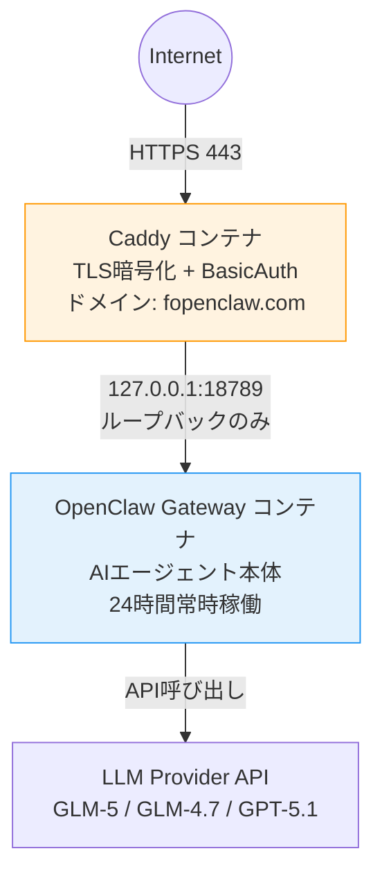
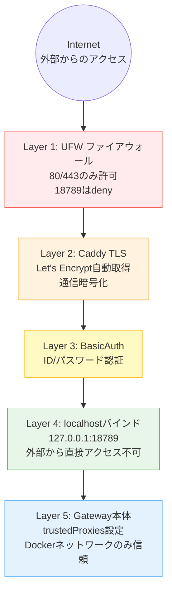

## はじめに

- OpenClawは `docker compose up -d` だけで起動するが、**本番運用**にはセキュリティと永続化の工夫が必要
- 3ヶ月本番運用して分かった、VPS上にOpenClawを安全に構築する手順を共有
- 構成: VPS(Debian) + Docker Compose + Caddy + UFW

## アーキテクチャ全体図

```
Internet（外部からのアクセス）
      |
      v
 +---------------+
 |     Caddy     |  ← TLS暗号化 + BasicAuth認証
 |  (コンテナA)   |     ドメイン: fopenclaw.com
 +---------------+
      | 127.0.0.1:18789（ループバックのみ）
      v
 +--------------------+
 | OpenClaw Gateway   |  ← AIエージェント本体
 |  (コンテナB)        |     24時間常時稼働
 +--------------------+
      | API呼び出し
      v
 +--------------------+
 | LLM Provider API   |  ← GLM-5 / GLM-4.7 / GPT-5.1
 +--------------------+
```



## Step 1: VPS初期設定

```bash
# パッケージ更新
sudo apt update && sudo apt upgrade -y

# 必要ツール導入
sudo apt install -y ufw fail2ban git curl

# UFW（ファイアウォール）設定
sudo ufw default deny incoming
sudo ufw allow 22/tcp   # SSH
sudo ufw allow 80/tcp   # HTTP（Caddy用）
sudo ufw allow 443/tcp  # HTTPS（Caddy用）
sudo ufw deny 18789     # Gateway直接アクセス禁止
sudo ufw enable
```

**注意**: 18789番ポート（Gateway）は明示的にdenyする。Caddy経由（80/443）のみアクセスを許可。

## Step 2: Docker Compose構成

```yaml
services:
  caddy:
    image: caddy:2
    ports:
      - "80:80"
      - "443:443"
    volumes:
      - ./Caddyfile:/etc/caddy/Caddyfile
      - caddy_data:/data
      - caddy_config:/config
    depends_on:
      - gateway

  gateway:
    image: ghcr.io/openclaw/openclaw:2026.3.12
    container_name: openclaw
    restart: unless-stopped
    ports:
      - "127.0.0.1:18789:18789"  # localhostのみ（重要！）
    volumes:
      - ./workspace:/home/node/.openclaw
      - ./ssh_keys:/home/node/.ssh:ro  # SSH鍵（読み取り専用）
    env_file:
      - .env  # APIキー等は環境変数で管理
```

### 重要な設定ポイント

1. **`127.0.0.1:18789:18789`**: バインド先をlocalhostに制限。外部から直接アクセス不可
2. **`restart: unless-stopped`**: コンテナが落ちても自動再起動
3. **`env_file: .env`**: APIキーをイメージに含めない。環境変数で注入
4. **SSH鍵の読み取り専用マウント**: コンテナ再作成で鍵が消える問題を回避

## Step 3: Caddy設定（TLS + BasicAuth）

```
your-openclaw.example.com {
    encode gzip
    log {
        output file /var/log/caddy/access.log
    }
    basicauth {
        deployer <ハッシュ化したパスワード>
    }
    reverse_proxy 127.0.0.1:18789
}
```

### Caddyを選んだ理由

- **TLS自動取得**: Let's Encrypt証明書を自動で取得・更新。nginxより設定が圧倒的に少ない
- **BasicAuth内蔵**: 追加ミドルウェア不要
- **設定ファイルが2行**: `reverse_proxy` だけで動く

### パスワードハッシュの生成

```bash
caddy hash-password --plaintext 'あなたのパスワード'
```

## Step 4: セキュリティ設定

### UFW（ファイアウォール）

```bash
sudo ufw status numbered
# 18789がdenyになっていることを確認
```

### 信頼できるプロキシ

```json
{
  "trustedProxies": ["127.0.0.1", "172.18.0.0/16"]
}
```

CaddyとDockerネットワークからのリクエストのみ信頼。なりすまし防止。

### 環境変数の管理

```bash
# .env（VPS側）— このファイルはGit管理しない
GLM_API_KEY=sk-xxxxx
DISCORD_BOT_TOKEN=MTQxxxxx
BRAVE_API_KEY=BSAxxxxx
OPENCLAW_GATEWAY_TOKEN=xxxxx
```

## Step 5: デプロイ手順

```bash
cd /home/op/openclaw-stack

# 起動
docker compose pull
docker compose up -d

# ログ確認
docker compose logs -f gateway

# ヘルスチェック
curl -u deployer:パスワード https://your-openclaw.example.com/status
# → {"status":"ok"} が返れば成功
```

## ハマりどころ3選

### 1. SSH鍵が消える

**問題**: `docker compose down && up` でコンテナ内のSSH鍵が消える（揮発性のため）

**解決**: VPS側の鍵を読み取り専用でマウント

```yaml
volumes:
  - /home/op/.ssh/id_ed25519:/home/node/.ssh/id_ed25519:ro
```

### 2. Chromiumが動かない

**問題**: 公式Dockerイメージにブラウザなし。Puppeteer（Webスクレイピングツール）がエラー

**解決**: DockerfileでChromiumを追加

```dockerfile
FROM ghcr.io/openclaw/openclaw:2026.3.12
RUN apt-get update && apt-get install -y chromium
```

設定: `"browser.executablePath": "/usr/bin/chromium"` + `"noSandbox": true`

### 3. 設定変更が反映されない

**解決**: `openclaw.json` は自動再読み込み（restart不要）。`.env` の変更は `docker compose down && up` が必要

## コスト内訳

| 項目 | 月額 |
|---|---|
| VPS（Debian） | ~$5 |
| ドメイン | ~$1 |
| LLM API（GLM） | 数千円〜 |
| **合計** | **月額約5,000〜8,000円** |

## まとめ

1. **Caddyが盾**: TLS + BasicAuth + リバースプロキシでGatewayを守る
2. **localhostバインド**: `127.0.0.1:18789` で外部アクセスを遮断
3. **永続化は意識的に**: SSH鍵・ワークスペースはボリュームマウント
4. **UFWで二重ガード**: ポートレベルでも18789をdeny
5. **`.env`で秘密管理**: APIキーはGitに含めない

OpenClawの本番運用は「Docker起動」だけでなく、この5つのセキュリティレイヤーを積むことで安心して24時間稼働させられる。



## 関連記事

- [公務員がOpenClawで24時間AI執事「フクロウ」を作った3ヶ月の記録](./openclaw-24h-owl-butler-3months) — このインフラの上で動く運用の全貌
- [OpenClaw × GLM-5で月額コストを抑えた24時間AIアシスタント運用](./openclaw-glm5-cost-optimization-24h) — インフラコストとAPIコストの全体像
- [Claude Code + OpenClaw 二刀流](./claude-code-openclaw-dual-wielding) — VPS（本番）とローカル（開発）の二台運用
- [AIエージェントにソウルを与える：OpenClawのカスタマイズ徹底解説](./openclaw-soul-memory-customization) — インフラ上で動くAIの性格・記憶設計
- [OpenClaw Heartbeat設計：AIに定期的にお仕事をさせる仕組み](./openclaw-heartbeat-cron-automation) — VPS上で定期実行するHeartbeat詳細

---

*この記事はClaude Code（GLM-5.1）と一緒に書きました。*
