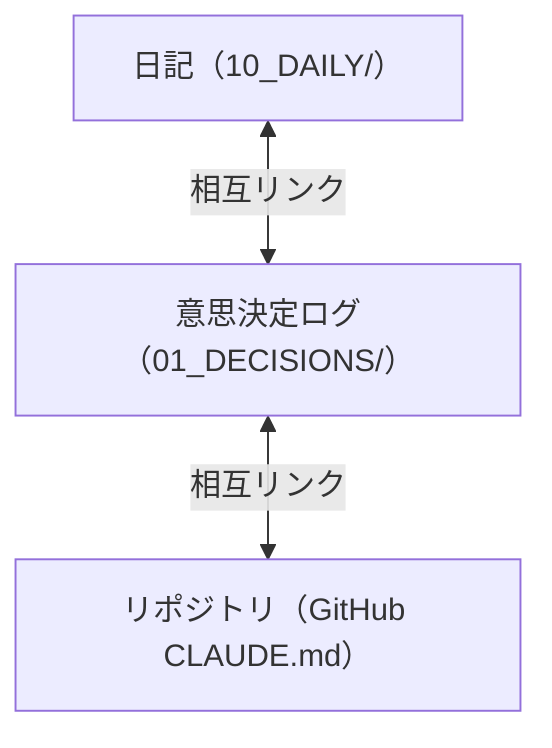

## はじめに

私は1年間で **300件以上の意思決定ログ** を記録しました。「なぜその技術を選んだのか」「なぜその設計にしたのか」——全て記録されています。

本記事では、SSOT（Single Source of Truth）運用1年目の知見を解説します。

## SSOTの構造

```
obsidian-ssot/
  00_SYSTEM/          ← 全体ルール・用語集・リポジトリ索引
  01_DECISIONS/       ← 意思決定ログ（300件+）
    claude-code/      ← Claude Code関連の判断
    atelier-kyo-manager/ ← 物販システム関連
    reserve-optimizer/   ← 予約システム関連
    NexusCore/        ← AIフレームワーク関連
  10_DAILY/           ← 毎日の作業ログ
  20_PUBLISHING/      ← Zenn記事ドラフト
  40_CAREER/          ← キャリア分析・職務経歴書
```

## 3層リンク構造



日記には**詳細を直書きしない**。サマリー + リンクのみ:

```markdown
## セッションログ (14:30)
- バックログ自動アーカイブ実装
- 詳細: 01_DECISIONS/claude-code/2026-05-24_バックログ導入.md
- 未解決: なし
```

## 1年目に学んだ5つの知見

### 1. 「後で書く」は絶対に書かない

**その場で書く**。5分後には忘れています。

CLAUDE.mdに記録ルールを書き、Claude Codeに自動記録させています:

```
Step 1: SSOT履歴ファイルの作成
Step 2: リポジトリドキュメントの更新
Step 3: 日記（ハブ）の更新
Step 4: バックログの更新（未解決問題がある場合）
```

### 2. 日記は「ハブ」にする

日記に詳細を直書きすると**肥大化**して読めなくなる。

```
❌ 日記に50行の技術詳細を直書き
✅ 日記に3行サマリー + 詳細ファイルへのリンク
```

### 3. 相互リンクは最初から書く

後から一括でリンクを追加するのは大変（338ファイルに一括追加した経験あり）。

新規ファイル作成時に**必ず関連ファイルへのリンクを書く**。

### 4. バックログで「忘れタスク」を防ぐ

複数セッションを同時稼働していると、タスクが流れて消える。

`00_SYSTEM/バックログ.md` に P0/P1/P2 の優先度で管理。SessionStart hook で自動読み込み。

### 5. 英語フォルダ名は日本語に変える

```
❌ 01_DECISIONS/career/          ← 何が入っているか分からない
✅ 01_DECISIONS/キャリア/         ← 直感的に分かる
```

但しGitHubリポジトリ名は英語のまま（URLの可読性のため）。

## 統計データ

| 指標 | 数値 |
|------|------|
| 意思決定ログ | 300件以上 |
| 日記 | 365日分 |
| バックログ項目 | 20件（未完了） |
| 相互リンク | 338ファイル間 |
| セッション数/日 | 平均3〜5 |

## まとめ

1. **その場で記録** — 「後で書く」は禁止
2. **日記はハブ** — 詳細は別ファイル、日記はリンク集
3. **相互リンク** — 作成時に書く、後から一括は辛い
4. **バックログ** — 忘れタスクを防止
5. **日本語フォルダ名** — 直感的な理解を優先

## 関連記事

- [Claude Codeバックログ管理をHooksで自動化](./claude-code-backlog-management-hooks) — SSOT運用を支えるタスク管理
- [公務員が20リポジトリで生き残る戦略](./civilservant-20repos-survival) — SSOTで管理する20プロジェクトの全体像
- [Claude Code設定の3層設計 — CLAUDE.mdをどう分割するか](./claude-code-claude-md-3-layer-design) — SSOTと連携するCLAUDE.md設計
- [Context Engineering入門 — 47KBの正体と対策](./context-engineering-47kb-tool) — SSOT肥大化の分析視点

---

*この記事はClaude Code（GLM-5.1）と一緒に書きました。*
