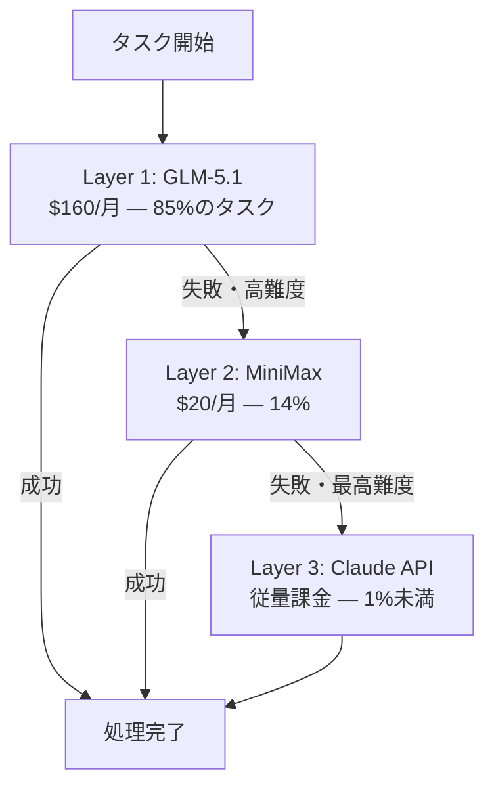

## はじめに

2025年5月、私はITとは無関係の公務員でした。プログラミング経験はゼロ。Pythonの`print("hello")`も書けない状態でした。

それから1年で、GitHubに20以上のプロジェクトを作りました（うち14を公開中）。AIエージェントフレームワーク、LINE Bot予約システム、物販管理システム、ブラウザ自動化ツール等々。

コードは**1行も書いていません**。全て日本語でAIに指示し、AIが実装しました。

本記事では、この「Vibe Coding（バイブコーディング）」という手法で1年間開発を続けて得た知見をまとめます。

## Vibe Codingとは

Vibe Codingとは、コードを直接書くのではなく、自然言語でAIに指示を出して開発を進める手法です。AIに「何を作りたいか」を伝え、AIがコードを生成・実装します。

2026年現在、「Vibe Coding エンジニア」「AIネイティブ プロダクトエンジニア」という職種の求人が実際に存在し、注目を集めています。

## 1年間の数字

| 指標 | 数値 |
|---|---|
| GitHubリポジトリ | 14公開 + 9非公開（計23） |
| 使用技術スタック | 15種以上（Python, TypeScript, GAS, React, FastAPI等） |
| テストコード | 4,862テスト以上（pytest） |
| 月間LLM処理量 | 27.4億トークン |
| 技術記事 | Zenn 15本公開済み |
| 意思決定記録 | 398件以上（SSOT管理） |
| コミット数（月間ピーク） | 101コミット |

## プロジェクト紹介（代表的なもの）

### AIエージェントフレームワーク: NexusCore

10以上の専門エージェント（要件定義・計画・実装・テスト・レビュー等）を協調動作させるマルチエージェントフレームワーク。6フェーズの開発パイプライン（要件定義→計画→アーキテクチャ→実装→テスト→レビュー）を自動実行します。

LLMルーターを内蔵し、タスク種別に応じてモデルを切り替える仕組みを持っています。

### LINE Bot予約管理システム: Reserve Optimizer

LINE Messaging API + Stripe決済 + Cloudflare Workersで構築した予約管理システム。ユーザーがLINE上で施術選択→日付→時間→決済→確認のフローを完結できます。

Stripe Webhookの署名検証、冪等性チェック、タイミング攻撃対策等のセキュリティ要件も、日本語の指示に組み込むことで実現しました。

### 物販管理システム: Atelier Kyo Manager

Flask + Playwright（ブラウザ自動化）+ 価格最適化エンジンで構築。スクレイピングによる価格監視、CSV取り込み、利益計算等を自動化しています。

### Obsidian SSOT: 全プロジェクト横断の知識基盤

全20リポジトリの意思決定記録を一元管理する知識ベース。日記↔決定記録↔リポジトリが相互リンクし、いつ・なぜ・どう決めたかを全てトレース可能にしています。

## Vibe Codingで上手くいくこと・いかないこと

### 上手くいくこと

| 項目 | 理由 |
|---|---|
| **アーキテクチャ設計の指示** | 「Handler/Service層で分離して」「Agent/Orchestratorパターンで」と伝えると、AIは高品質な構造を生成する |
| **セキュリティ要件の実装** | 「タイミング攻撃対策して」「冪等性チェックを入れて」と指示すると、AIは正しく実装する |
| **テストコードの生成** | 「この関数のユニットテストを書いて」と指示すると、AIは包括的なテストを生成する |
| **反復改善** | 「このエラーを修正して」「リファクタリングして」と繰り返すことで、品質が段階的に向上する |
| **ドキュメント生成** | 仕様書、README、技術記事の生成はAIが非常に得意 |

### 上手くいかないこと（工夫が必要）

| 項目 | 原因 | 対策 |
|---|---|---|
| **テスタビリティ** | AIは「動くコード」を優先し、「テストしやすいコード」を二の次にする | 「DIパターンで実装して」「コンストラクタで注入して」を明示的に指示 |
| **エラー処理の統一** | AIはbare exceptや例外握りつぶしを生成しがち | 「全ての例外にログを付けて」と指示。コードレビューで検出 |
| **コードの読解** | AIが書いたコードを自分で理解するのは困難 | 自作のコードレビュープロンプトで品質を7軸評価し、弱点を定量把握 |

## AI駆動開発で品質を担保する方法

AIにコードを書かせる開発スタイルで、どうやって品質を担保しているのか。これが最もよく聞かれる質問です。

### 1. テストを書かせる

AIにテストコードを生成させ、実行してパスすることを確認します。NexusCoreでは4,798テストが全て通過しています。テストが通れば、最低限の動作保証はできます。

### 2. 自作のコードレビュープロンプト

AIが生成したコードを、別のAIに評価させる手法を開発しました。7軸（アーキテクチャ・セキュリティ・テスタビリティ・エラー処理・保守性・パフォーマンス・ドキュメント）で★1〜5評価し、改善項目をリスト化します。

この手法で3プロジェクト30ファイルを評価した結果、セキュリティとアーキテクチャで全ファイルA評価を達成。テスタビリティが全プロジェクト共通の弱点であることも特定し、20項目のリファクタリングを実行しました。

### 3. Mutation Testing

テストの品質自体を測るために、mutmut（Mutation Testingツール）を導入しました。コードに意図的なバグを仕込み、テストがそれを検出できるかを確認する手法です。543個のバグ変異に対し、325個をテストが検出。残り218個は「等価変異（コードを変えても動作が変わらない）」であることを確認しました。

### 4. 複数LLMでのクロスチェック

1つのLLMだけでなく、GLM、MiniMax、Claude Opusの3LLMで同じ評価を実施し、合意形成。単一LLMのバイアスを軽減します。

## LLMルーティング: コスト最適化

月間27.4億トークンを処理するため、コスト最適化は必須でした。

3層構成で運用しています。

合計$180/月（約28,000円）で、Claude Code Max（$220/月）より安く、かつ使用量は大幅に多い構成です。さらに、429レートリミット対策のローカルプロキシを開発し、使用率に応じて自動的にモデルを切り替える仕組みも構築しました。

## 1年間で学んだ教訓

### 1. 「何を作るか」の設計力が最も重要

コードを書くスキルではなく、「AIに何をどう伝えるか」の設計力が成果を左右します。ドメイン知識（予約管理の業務フロー、決済のセキュリティ要件等）を正確に言語化できることが、Vibe Codingの核心です。

### 2. 品質管理は仕組み化する

AIが書いたコードをそのまま信頼してはいけません。テスト、コードレビュー、Mutation Testingといった品質管理の仕組みを自前で構築することで、コードを読めなくても品質を担保できます。

### 3. 失敗は記録する

323件の意思決定記録（SSOT）があるからこそ、「なぜこの設計にしたのか」「何が失敗だったか」を振り返れます。Vibe Codingでは特に、AIへの指示の良し悪しが結果に直結するため、記録が重要です。

### 4. 単一プロバイダーに依存しない

LLMプロバイダーは429エラー、障害、仕様変更等のリスクがあります。マルチプロバイダー構成でレジリエンスを確保することが、継続的な開発に不可欠です。

## Vibe Codingの限界

正直に限界も書いておきます。

- **コードの読解ができない**: AIが生成したコードの動作を、自分で説明できない場面があります。面接等で「このコードはどう動くか」と聞かれると、答えられないことがあります。
- **チーム開発経験がない**: 個人開発のみで、他者とのコードレビューやペアプロの経験がありません。
- **深いデバッグが困難**: 複雑なバグの原因特定は、AIに頼らざるを得ない場面があります。

これらの限界を認識した上で、Python基礎学習やOSS貢献を通じて改善を進めています。

## おわりに

1年前、私はコードの`print("hello")`も書けない公務員でした。今でも書けません。しかし、AIへの指示設計、品質管理の仕組み化、LLMルーティングの最適化を通じて、20以上のプロジェクトを開発・運用しています（うち14をGitHubで公開中）。

Vibe Codingは「コードを書けない人の逃げ道」ではありません。AIに何をどう作らせるかを設計する、新しいスキルセットだと考えています。ドメイン知識を言語化し、品質を仕組みで担保し、継続的に改善する。このサイクルを回すことが、Vibe Codingの実践です。

### 関連記事

- [Claude Code CLIをGLM（Z.AI）で代替した話（コスト大幅削減の実測）](https://zenn.dev/fukukei23/articles/claude-code-cost-optimization)
- [Claude Code CLIにMiniMaxをフォールバックとして組み込んだ話](https://zenn.dev/fukukei23/articles/claude-code-minimax-fallback)
- [月間27億トークンを処理したLLMルーティングの実運用レポート](https://zenn.dev/fukukei23/articles/llm-routing-one-month-report)
