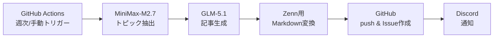

## はじめに

「Zenn記事をAIで自動生成したい」——でも、Anthropic API（Claude）を使うとコストがかさみます。

私は **GLM-5.1 + MiniMax-M2.7** の組み合わせで、Zenn記事の半自動パイプラインを構築しました。

本記事では、Anthropic SDK → OpenAI SDK への移行を含む構築過程を解説します。

## パイプライン構成



## Anthropic → OpenAI SDK移行

### Before: Anthropic SDK

```python
import anthropic

client = anthropic.Anthropic()
response = client.messages.create(
    model="claude-sonnet-4-6",
    messages=[{"role": "user", "content": prompt}]
)
```

**課題**: コストが高い。月額$220のMaxプランでも使用量制限がある。

### After: OpenAI SDK（GLM/MiniMax共通）

```python
from openai import OpenAI

# GLM-5.1
glm_client = OpenAI(
    api_key=os.environ["GLM_API_KEY"],
    base_url="https://api.z.ai/api/anthropic/v1"  # Z.AI（OpenAI互換エンドポイント）
)

# MiniMax-M2.7
minimax_client = OpenAI(
    api_key=os.environ["MINIMAX_API_KEY"],
    base_url="https://api.minimax.chat/v1"
)
```

**メリット**: OpenAI SDK 1つで複数プロバイダーに対応。GLMは月額$160で60x Pro使用量。

## 各ステップの実装

### Step 1: トピック抽出（MiniMax）

```python
def extract_topics(client, tech_trends: str) -> list[dict]:
    response = client.chat.completions.create(
        model="MiniMax-M2.7",
        messages=[{
            "role": "user",
            "content": f"以下のトレンドからZenn記事のトピックを3つ提案:\n{tech_trends}"
        }]
    )
    return parse_topics(response.choices[0].message.content)
```

**MiniMaxを使う理由**: トピック抽出は「大量処理・低精度でも可」なタスク。コスト効率重視。

### Step 2: 記事生成（GLM-5.1）

```python
def generate_article(client, topic: dict) -> str:
    response = client.chat.completions.create(
        model="glm-5.1",
        messages=[{
            "role": "system",
            "content": "あなたはZenn技術記事の執筆者です。"
        }, {
            "role": "user",
            "content": f"以下のトピックでZenn記事を書いて:\n{topic}"
        }],
        max_tokens=4096
    )
    return response.choices[0].message.content
```

**GLMを使う理由**: 記事生成は品質重視。GLM-5.1が最もコスパが良い。

### Step 3: Zenn用Markdown変換

```python
def to_zenn_format(article: str, topic: str) -> str:
    return f"""---
title: "{topic}"
emoji: "📝"
type: "tech"
topics: ["ai", "automation", "github", "llm"]
published: false
---

{article}
"""
```

### Step 4-5: 通知・Issue作成

```python
# Discord通知
requests.post(DISCORD_WEBHOOK_URL, json={
    "content": f"📝 新規記事ドラフト: {topic}"
})

# GitHub Issue作成
gh = Github(GITHUB_TOKEN)
repo = gh.get_repo("fukukei23/zenn")
repo.create_issue(
    title=f"新規記事: {topic}",
    body=f"ドラフト生成完了。レビュー後にpublished: trueに変更。"
)
```

## つまずいたポイント

### MiniMax 404エラー

```python
# ❌ 間違い
base_url="https://api.minimax.chat/v1/text/chatcompletion_v2"

# ✅ 正しい
base_url="https://api.minimax.chat/v1"
# modelパラメータで "MiniMax-M2.7" を指定
```

### GLM APIのbase_url

GLM APIはAnthropic互換エンドポイントを提供:

```python
# Anthropic SDK互換
base_url="https://api.z.ai/api/anthropic/v1"

# しかしOpenAI SDKからもアクセス可能（非公式）
```

### GitHub Secretsの設定

4つのSecretsが必要:

```
GLM_API_KEY
MINIMAX_API_KEY
PERSONAL_ACCESS_TOKEN
DISCORD_WEBHOOK_URL
```

## コスト比較

| 構成 | 月額コスト | 生成可能記事数 |
|------|-----------|-------------|
| Anthropic Sonnet API従量 | ~$50/月 | 10本 |
| **GLM + MiniMax サブスク** | **$160/月（共用）** | **無制限** |

サブスクのGLMを使えば、記事生成のコストは実質ゼロ（他の開発と共用）。

## まとめ

1. **OpenAI SDKでマルチプロバイダー対応** — GLMもMiniMaxも同じSDKで呼び出し可能
2. **タスク別モデル使い分け** — 抽出はMiniMax（低コスト）、生成はGLM（高品質）
3. **サブスク活用で実質ゼロコスト** — API従量課金より圧倒的に安い

## 関連記事

- [AIコードレビューの幻覚を3LLM合意で検証](./ai-code-review-hallucination-verification) — マルチLLM活用の別事例
- [公務員が20リポジトリで生き残る戦略](./civilservant-20repos-survival) — LLMルーティングを支える開発戦略
- [SSOT300件の意思決定ログから学んだ教訓](./ssot-300-decision-logs-lessons) — 記事生成パイプラインの記録運用

---

*この記事はClaude Code（GLM-5.1）と一緒に書きました。*
